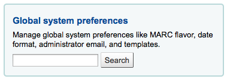
.. |image1| image:: images/admin/globalprefs/prefsearch1.png
.. |image2| image:: images/admin/globalprefs/saveallprefs.png
.. |image3| image:: images/admin/globalprefs/saveconfirmation.png
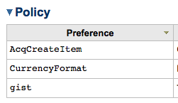
.. |image5| image:: images/admin/globalprefs/Google/2newproject.png
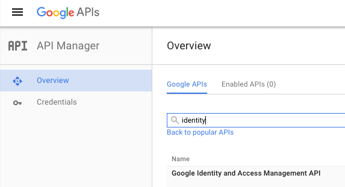
.. |image7| image:: images/admin/globalprefs/Google/4enable.png
.. |image8| image:: images/admin/globalprefs/Google/5consent.png
.. |image9| image:: images/admin/globalprefs/Google/6credtype.png
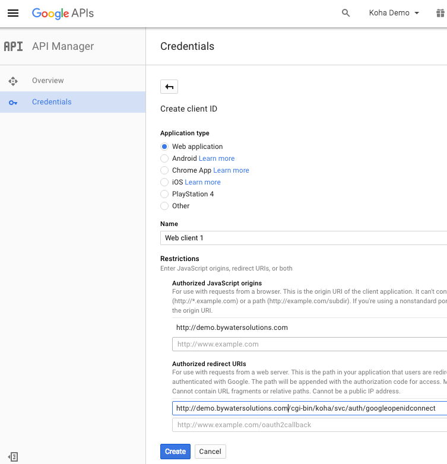
.. |image11| image:: images/admin/globalprefs/Google/8oauth.png

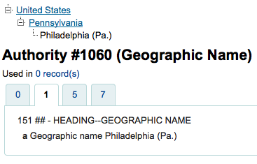
.. |image15| image:: images/admin/globalprefs/hide_marc-display.png
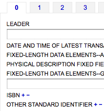
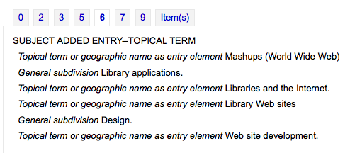
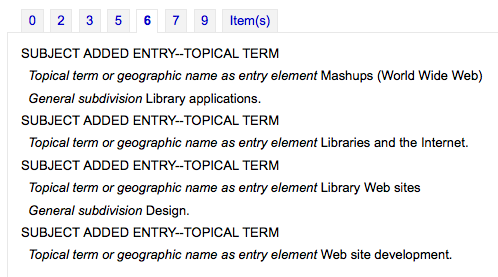
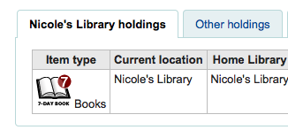
.. |image20| image:: images/admin/globalprefs/advancedMARCeditor-display.png
.. |image21| image:: images/admin/globalprefs/advancedMARCeditor-dontdisplay.png
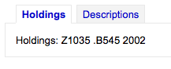
.. |image23| image:: images/admin/globalprefs/item-level_itypes.png
.. |image24| image:: images/admin/globalprefs/SpineLabelShowPrintOnBibDetails.png
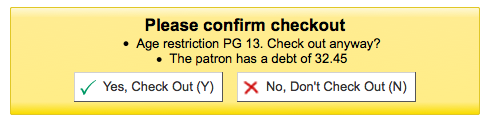

.. |image27| image:: images/admin/globalprefs/AllowTooManyOverride-yes.png
.. |image28| image:: images/admin/globalprefs/AllowTooManyOverride-no.png
.. |image29| image:: images/admin/globalprefs/IssueLostItem-msg.png
.. |image30| image:: images/admin/globalprefs/IssueLostItem-confirm.png
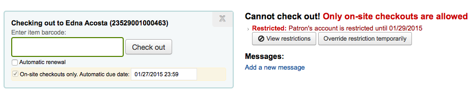

.. |image33| image:: images/admin/globalprefs/CircAutocompl.png
.. |image34| image:: images/admin/globalprefs/FilterBeforeOverdueReport.png
.. |image35| image:: images/admin/globalprefs/FineNotifyAtCheckin.png
.. |image36| image:: images/admin/globalprefs/DisplayClearScreenButtonOff.png
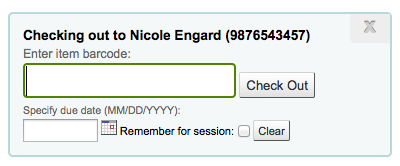
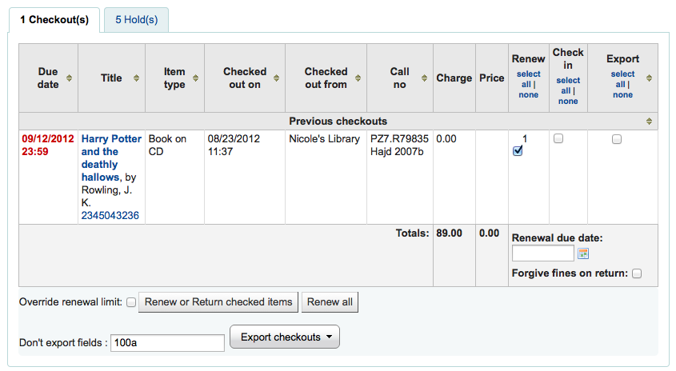
.. |image39| image:: images/admin/globalprefs/ExportWithCsvProfile.png
.. |image40| image:: images/admin/globalprefs/itemBarcodeFallbackSearch.png
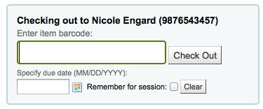
.. |image42| image:: images/admin/globalprefs/SpecifyDueDate-no.png
.. |image43| image:: images/admin/globalprefs/WaitingNotifyAtCheckin.png
.. |image44| image:: images/circ/selfcheckout.png
.. |image45| image:: images/circ/SelfCheckoutByLogin.png
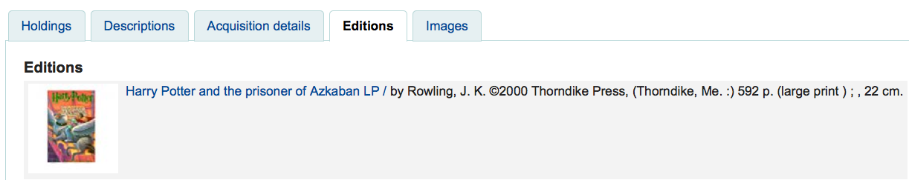
.. |image47| image:: images/admin/globalprefs/editions.png
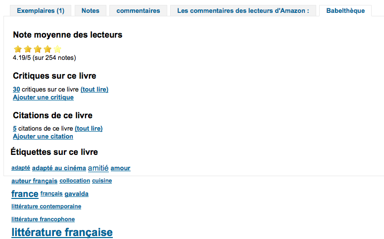

.. |image50| image:: images/admin/globalprefs/HTML5MediaEnabled-staff.png
.. |image51| image:: images/admin/globalprefs/IDreamBooksReadometer.png
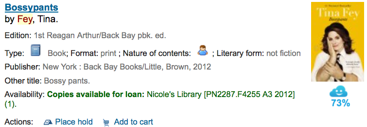

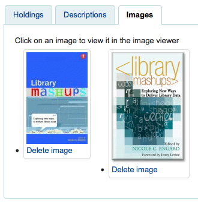
.. |image55| image:: images/admin/globalprefs/novelisttab.png
.. |image56| image:: images/admin/globalprefs/novelistside.png
.. |image57| image:: images/admin/globalprefs/Overdrive.png
.. |image58| image:: images/admin/globalprefs/TagsInputOnList.png

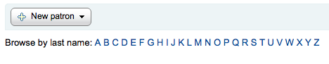
.. |image61| image:: images/admin/globalprefs/opaclanguagesdisplay.png
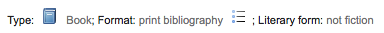
.. |image63| image:: images/admin/globalprefs/hidelostitems.png
.. |image64| image:: images/admin/globalprefs/LibraryName.png

.. |image67| image:: images/admin/globalprefs/OPACBaseURL.png
.. |image68| image:: images/admin/globalprefs/opaccredits-html.png
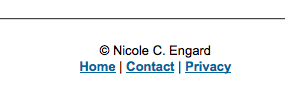
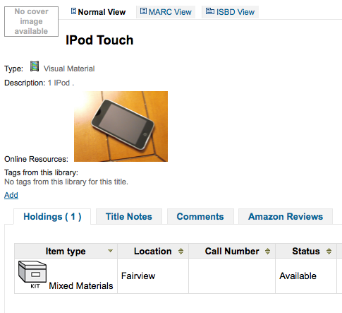
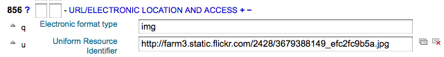
.. |image72| image:: images/admin/globalprefs/favicon.png
.. |image73| image:: images/admin/globalprefs/opacheader-html.png
.. |image74| image:: images/admin/globalprefs/opacheader.png
.. |image75| image:: images/admin/globalprefs/OpacKohaUrl.png
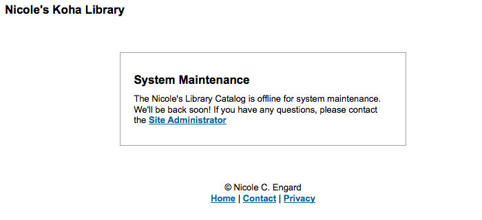
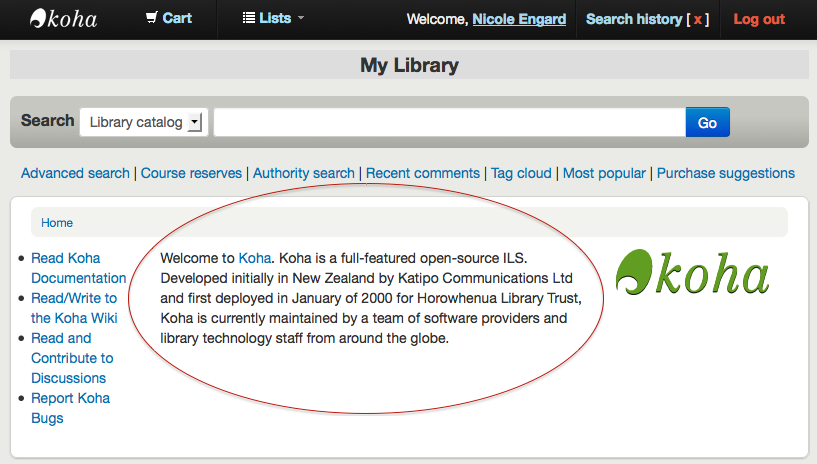
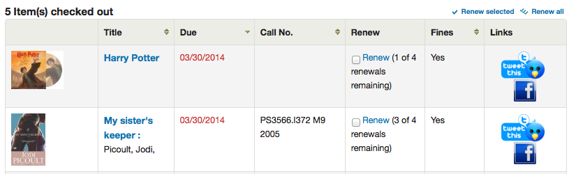
.. |image79| image:: images/admin/globalprefs/OpacNav.png
.. |image80| image:: images/admin/globalprefs/OpacNavBottom.png

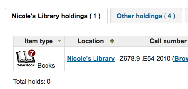
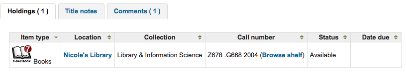
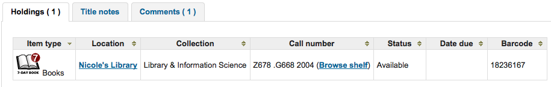
.. |image88| image:: images/admin/globalprefs/OpacShowRecentComments.png
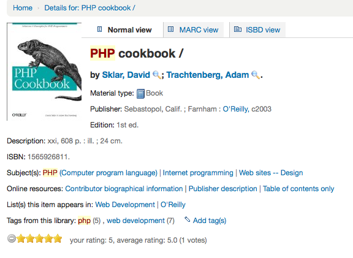
.. |image90| image:: images/admin/globalprefs/OpacStarRatings-results.png
.. |image91| image:: images/admin/globalprefs/opacuserjs-before.png
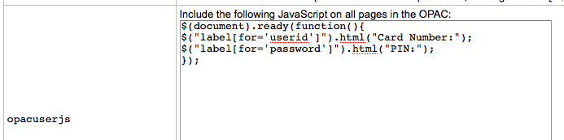
.. |image93| image:: images/admin/globalprefs/opacuserjs-after.png
.. |image94| image:: images/admin/globalprefs/authoritysearch.png
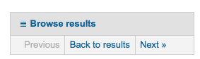
.. |image96| image:: images/admin/globalprefs/OpacHoldNotes.png
.. |image97| image:: images/admin/globalprefs/OPACPatronDetails.png
.. |image98| image:: images/admin/globalprefs/OPACPatronDetails-approve.png

.. |image100| image:: images/admin/globalprefs/topissues.png
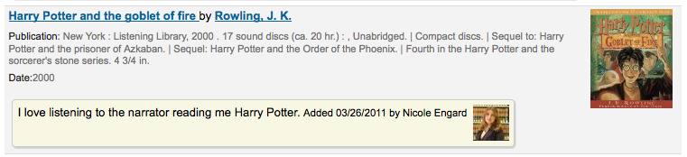
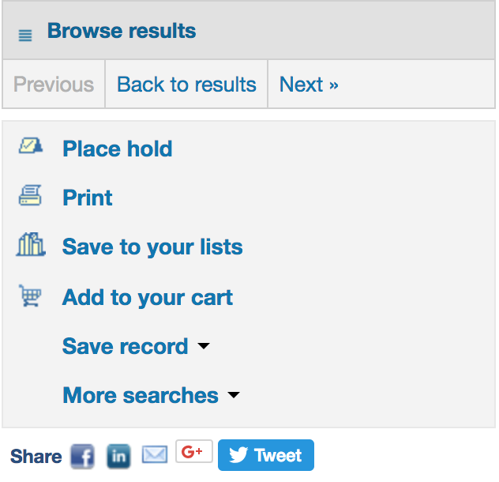
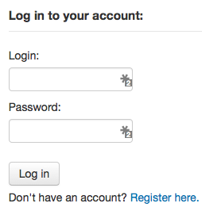
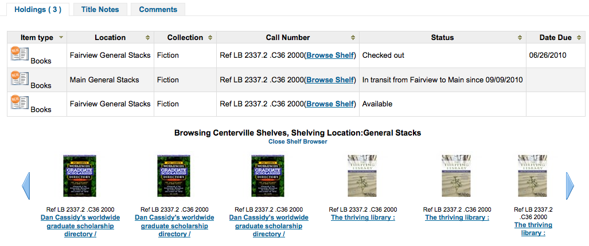
.. |image105| image:: images/admin/globalprefs/SMSSendDriver.png
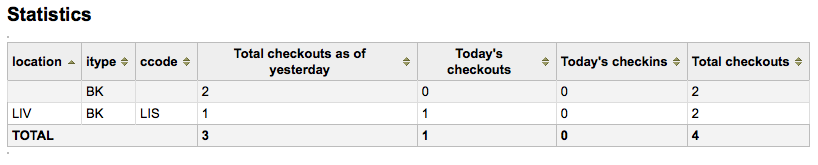
.. |image107| image:: images/admin/globalprefs/displayFacetCount.png
.. |image108| image:: images/admin/globalprefs/AdvancedSearchTypes.png
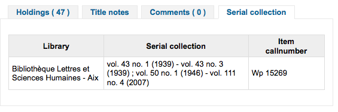
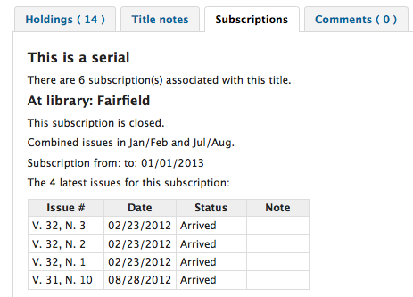
.. |image111| image:: images/admin/globalprefs/SubscriptionHistory-brief.png
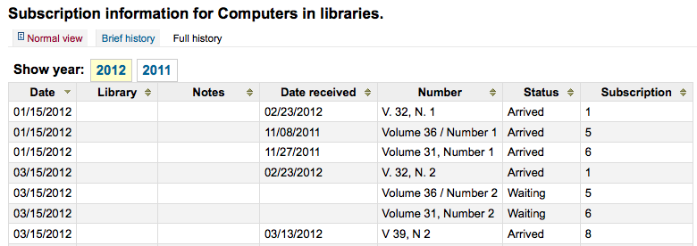
.. |image113| image:: images/admin/globalprefs/Display856uAsImage.png

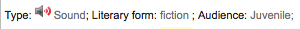
.. |image116| image:: images/admin/globalprefs/favicon.png
.. |image117| image:: images/admin/globalprefs/IntranetmainUserblock-html.png
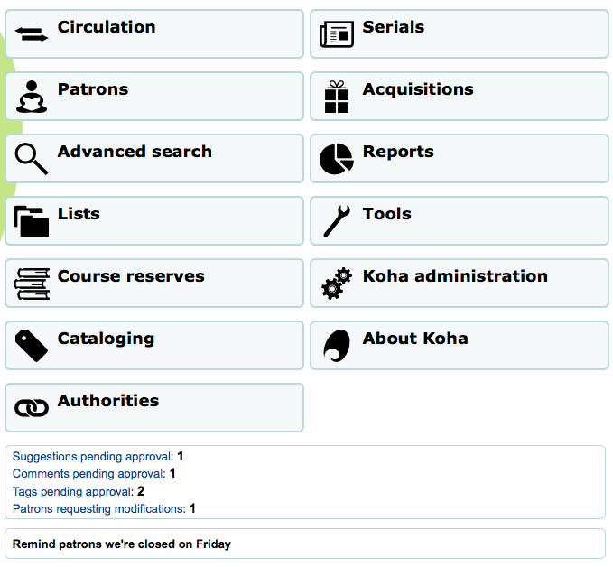
.. |image119| image:: images/admin/globalprefs/XSLTDetailsDisplay-off.png
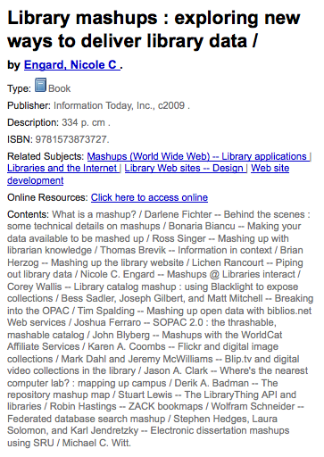
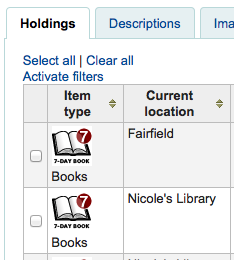
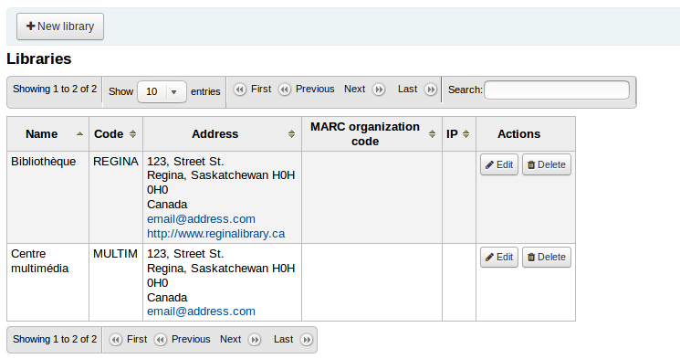
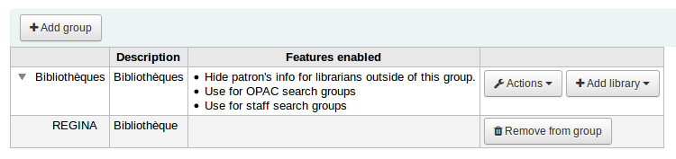
.. |image124| image:: images/admin/basicparams/newlibrary.png
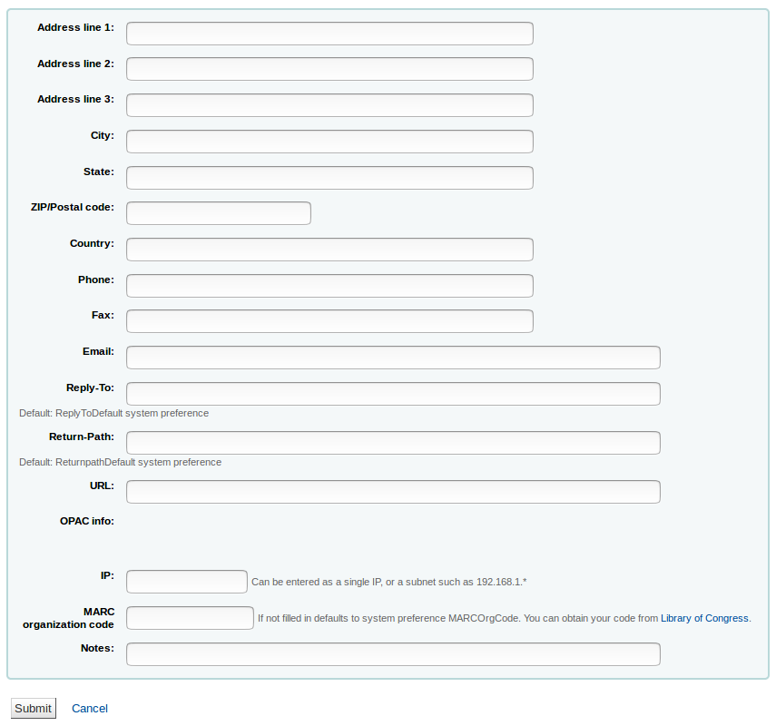
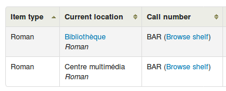
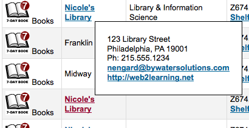

.. |image130| image:: images/admin/basicparams/searchgroup.png

.. |image132| image:: images/admin/basicparams/groupproperties.png

.. |image136| image:: images/admin/basicparams/itemtype-msgsetup.png

.. |image138| image:: images/admin/basicparams/itemtype-alert.png

.. |image140| image:: images/admin/basicparams/nodeleteitemtype.png
.. |image141| image:: images/admin/basicparams/bor_notes.png
.. |image142| image:: images/admin/basicparams/report_group.png

.. |image153| image:: images/admin/patroncirc/hidelostitemspatron.png

.. |image156| image:: images/admin/patroncirc/selectissuinglibrary.png

.. |image163| image:: images/admin/patroncirc/holdsperitem.png

.. |image166| image:: images/admin/patroncirc/showattribute.png

.. |image172| image:: images/admin/patroncirc/collectcodes.png

.. |image174| image:: images/admin/patroncirc/transferlimits.png
.. |image175| image:: images/admin/patroncirc/transportcostmatrix.png
.. |image176| image:: images/admin/patroncirc/librariesforalert.png

.. |image178| image:: images/admin/patroncirc/newcity.png
.. |image179| image:: images/admin/patroncirc/cities.png
.. |image180| image:: images/admin/patroncirc/patroncity.png

.. |image184| image:: images/admin/cataloging/startnewframework.png
.. |image185| image:: images/admin/cataloging/editframework.png

.. |image187| image:: images/admin/cataloging/newtagform.png

.. |image190| image:: images/admin/cataloging/editsubfield.png

.. |image193| image:: images/admin/cataloging/otheroptssubfield.png
.. |image194| image:: images/admin/cataloging/504auth.png
.. |image195| image:: images/admin/cataloging/importexport.png

.. |image197| image:: images/admin/cataloging/importexport.png
.. |image198| image:: images/admin/cataloging/importfile.png
.. |image199| image:: images/admin/cataloging/importconfirm.png
.. |image200| image:: images/admin/cataloging/importtimer.png

.. |image206| image:: images/admin/cataloging/frameworktest.png

.. |image208| image:: images/admin/cataloging/addclasssource.png
.. |image209| image:: images/admin/cataloging/newmatchrule.png
.. |image210| image:: images/admin/cataloging/samplematchrule.png

.. |image214| image:: images/admin/acquisitions/budgetslist.png

.. |image216| image:: images/admin/acquisitions/budgetslist.png
.. |image217| image:: images/admin/acquisitions/budgetslist.png
.. |image218| image:: images/admin/acquisitions/duplicatebudget.png
.. |image219| image:: images/admin/acquisitions/duplicatestartend.png
.. |image220| image:: images/admin/acquisitions/closereport.png
.. |image221| image:: images/admin/acquisitions/newfund.png

.. |image224| image:: images/admin/acquisitions/fundlist.png

.. |image227| image:: images/admin/acquisitions/planningpulldown.png

.. |image229| image:: images/admin/acquisitions/addplanningcol.png
.. |image230| image:: images/admin/acquisitions/autofill.png
.. |image231| image:: images/admin/acquisitions/planningcsv.png
.. |image232| image:: images/admin/additional/z39list.png
.. |image233| image:: images/admin/additional/newz39.png

.. |image237| image:: images/admin/additional/didyoumeanopacexplode.png
.. |image238| image:: images/admin/additional/didyoumeanopacauth.png

.. |image244| image:: images/admin/additional/togglecolumns.png

.. |image248| image:: images/tools/patronlists/addpatrontolist.png

.. |image254| image:: images/tools/comments/commentapproved.png

.. |image256| image:: images/tools/importpatrons/patronmatch.png

.. |image259| image:: images/tools/notices/newnotice.png

.. |image261| image:: images/tools/patroncards/addlayout.png

.. |image265| image:: images/tools/patroncards/edittemplate.png

.. |image268| image:: images/tools/patroncards/newprofile.png
.. |image269| image:: images/tools/patroncards/addprofile.png

.. |image272| image:: images/tools/patroncards/newbatch.png
.. |image273| image:: images/tools/patroncards/cards.png
.. |image274| image:: images/tools/patroncards/imageupload.png
.. |image275| image:: images/tools/patroncards/imageuploaded.png
.. |image276| image:: images/tools/patroncards/imagedelete.png

.. |image284| image:: images/tools/tagging/tagpending.png
.. |image285| image:: images/tools/tagging/tagsummary.png
.. |image286| image:: images/tools/tagging/tagapproved.png
.. |image287| image:: images/tools/tagging/tagblacklisttest-neither.png

.. |image290| image:: images/tools/patronphotos/uploadimagetool.png
.. |image291| image:: images/tools/patronphotos/imageuploadconfirm.png

.. |image296| image:: images/tools/batchmod/batchmodresults.png
.. |image297| image:: images/tools/batchmod/editinbatch.png
.. |image298| image:: images/tools/batchdelete/batchdel.png

.. |image300| image:: images/tools/batchdelete/toomanytodelete.png
.. |image301| image:: images/tools/batchdelete/nobatchdel.png
.. |image302| image:: images/tools/batchdelete/batchdeldone.png

.. |image304| image:: images/tools/autoitemmodage/savedrule.png
.. |image305| image:: images/tools/autoitemmodage/addeditrules.png
.. |image306| image:: images/tools/autoitemmodage/ruleform.png
.. |image307| image:: images/tools/autoitemmodage/savedrule.png

.. |image309| image:: images/tools/exportmarc/fileexport.png

.. |image313| image:: images/tools/exportmarc/authexport-pt2.png
.. |image314| image:: images/tools/exportmarc/authexport-pt3.png

.. |image319| image:: images/tools/labelcreator/labelform.png

.. |image323| image:: images/tools/labelcreator/newprofileform.png

.. |image332| image:: images/tools/labelcreator/searchforbatch.png

.. |image334| image:: images/tools/labelcreator/itemsinbarch.png

.. |image342| image:: images/tools/marcmodtemplates/duplicate.png
.. |image343| image:: images/tools/marcmodtemplates/templatechoice.png

.. |image348| image:: images/tools/marcimport/templatechoice.png

.. |image360| image:: images/tools/marcimport/reservoirresults.png

.. |image364| image:: images/tools/uploadlocalimg/bibnumurl.png
.. |image365| image:: images/tools/uploadlocalimg/bibnummarc.png
.. |image366| image:: images/tools/uploadlocalimg/zipfiles.png
.. |image367| image:: images/tools/uploadlocalimg/uploadsummary.png

.. |image370| image:: images/tools/calendar/calendaradd.png

.. |image372| image:: images/tools/calendar/calendarsummary.png

.. |image378| image:: images/tools/csvprofiles/downloadcsv.png
.. |image379| image:: images/tools/csvprofiles/csvfieldsep.png
.. |image380| image:: images/tools/csvprofiles/csvadded.png
.. |image381| image:: images/tools/csvprofiles/modifycsv.png

.. |image383| image:: images/tools/csvprofiles/deletecsv.png

.. |image385| image:: images/tools/logs/logviewer.png

.. |image392| image:: images/tools/tasksched/taskscheduler.png
.. |image393| image:: images/tools/tasksched/scheduledreports.png
.. |image394| image:: images/tools/tasksched/savedreports.png

.. |image397| image:: images/tools/qotd/addquote.png

.. |image405| image:: images/tools/qotd/confirmdelete.png

.. |image410| image:: images/patrons/addGuarantor.png
.. |image411| image:: images/patrons/addOrg.png
.. |image412| image:: images/patrons/addaltcontact.png

.. |image417| image:: images/patrons/addpatronmsg.png
.. |image418| image:: images/patrons/duplicatewarn.png

.. |image421| image:: images/patrons/newinhouse.png

.. |image423| image:: images/patrons/duplicatedpatron.png
.. |image424| image:: images/patrons/duplicatedpatronfinal.png

.. |image430| image:: images/patrons/patronaddimage.png

.. |image433| image:: images/patrons/patroncardlost.png
.. |image434| image:: images/patrons/addpatronrestriction.png
.. |image435| image:: images/patrons/restricteduntil.png

.. |image437| image:: images/patrons/choosadulttype.png

.. |image442| image:: images/patrons/myaccount.png
.. |image443| image:: images/patrons/child.png

.. |image448| image:: images/patrons/patronrestrictions.png

.. |image453| image:: images/patrons/paypartial.png

.. |image456| image:: images/patrons/payselected.png

.. |image461| image:: images/patrons/patroninvoice.png
.. |image462| image:: images/patrons/routinglisttab.png
.. |image463| image:: images/patrons/patronroutinglists.png

.. |image465| image:: images/patrons/readinghistory-export.png
.. |image466| image:: images/patrons/borrowerlog.png
.. |image467| image:: images/patrons/patnoticestab.png

.. |image471| image:: images/patrons/patronfilestab.png
.. |image472| image:: images/patrons/nopatronfiles.png

.. |image476| image:: images/patrons/dischargeletter.png

.. |image478| image:: images/patrons/patronsearchexpand.png
.. |image479| image:: images/patrons/patronfieldsearch.png

.. |image481| image:: images/patrons/patronbrowse.png

.. |image483| image:: images/circ/checkoutpatron.png

.. |image485| image:: images/circ/checkingout-noshow.png

.. |image491| image:: images/circ/patronnotes.png

.. |image494| image:: images/circ/printslip.png

.. |image496| image:: images/circ/batchcheckoutwarn.png

.. |image499| image:: images/circ/fineswarning.png

.. |image502| image:: images/circ/addresswarning.png

.. |image506| image:: images/circ/warnings/holdwaiting.png
.. |image507| image:: images/circ/warnings/alreadycheckedout.png
.. |image508| image:: images/circ/warnings/checkedoutelse.png
.. |image509| image:: images/circ/warnings/notforloan.png
.. |image510| image:: images/circ/warnings/toomanycheckouts.png
.. |image511| image:: images/circ/warnings/toomanycheckouts-no.png
.. |image512| image:: images/circ/warnings/norenewals.png
.. |image513| image:: images/circ/barcodefastadd.png
.. |image514| image:: images/circ/lostitemmsg.png
.. |image515| image:: images/circ/lostitemconfirm.png

.. |image517| image:: images/circ/warnings/decreaseLoanHighHoldsDuration.png
.. |image518| image:: images/circ/circsummary.png
.. |image519| image:: images/circ/renewbutton.png

.. |image522| image:: images/circ/renewbarcode.png
.. |image523| image:: images/circ/renewed.png
.. |image524| image:: images/circ/renewnomatch.png

.. |image526| image:: images/circ/checkinmain.png

.. |image528| image:: images/circ/checkinlink.png

.. |image533| image:: images/circ/transfercheckin.png

.. |image535| image:: images/circ/holdfound.png
.. |image536| image:: images/circ/waitingstatus.png

.. |image538| image:: images/circ/intransithold.png
.. |image539| image:: images/admin/globalprefs/FineNotifyAtCheckin.png
.. |image540| image:: images/circ/bor_notes.png
.. |image541| image:: images/circ/staffmessages.png
.. |image542| image:: images/circ/leavecircmsg.png
.. |image543| image:: images/circ/staffmessages.png

.. |image546| image:: images/circ/placeholdsearch.png
.. |image547| image:: images/circ/placeholdfindpatron.png
.. |image548| image:: images/circ/searchtohold.png

.. |image550| image:: images/circ/holdmultiresults.png

.. |image552| image:: images/circ/placeholdmultiple.png
.. |image553| image:: images/circ/forgethold.png
.. |image554| image:: images/circ/holdtab.png

.. |image556| image:: images/circ/holdpriority.png

.. |image558| image:: images/circ/suspendholds.png
.. |image559| image:: images/circ/cancelholds.png

.. |image565| image:: images/circ/transfer.png
.. |image566| image:: images/circ/itemtransferred.png

.. |image568| image:: images/circ/itemlocations.png

.. |image570| image:: images/circ/setlibrary.png

.. |image572| image:: images/circ/fastadd.png
.. |image573| image:: images/circ/barcodefastadd.png
.. |image574| image:: images/circ/fastaddbarcode.png
.. |image575| image:: images/circ/fastadditem.png
.. |image576| image:: images/circ/fastaddcheckedout.png
.. |image577| image:: images/circ/holdsqueue.png

.. |image579| image:: images/circ/refineholdstopull.png

.. |image582| image:: images/circ/holdratio.png
.. |image583| image:: images/circ/transitreceive.png
.. |image584| image:: images/circ/transferlate.png

.. |image587| image:: images/circ/checkoutinhouse.png

.. |image590| image:: images/circ/LOCvalues.png
.. |image591| image:: images/circ/selfcheckoutlink.png
.. |image592| image:: images/circ/selfcheckout.png
.. |image593| image:: images/circ/SelfCheckoutByLogin.png

.. |image595| image:: images/circ/selfcheckoutsummary.png

.. |image599| image:: images/circ/syncoffline.png

.. |image602| image:: images/circ/offlineduedate.png
.. |image603| image:: images/circ/offlinecheckouts.png

.. |image605| image:: images/circ/viewkohaoffline.png
.. |image606| image:: images/circ/offlinecirclog.png

.. |image608| image:: images/circ/koctstatusbar.png

.. |image610| image:: images/circ/koctwarn.png

.. |image614| image:: images/circ/koctcount.png

.. |image616| image:: images/circ/offlinecirclink.png
.. |image617| image:: images/circ/offlinecirclog.png

.. |image620| image:: images/circ/koctwarn.png
.. |image621| image:: images/circ/offlinecirclink.png

.. |image623| image:: images/circ/processoffline.png

.. |image625| image:: images/circ/offlinecirclog.png

.. |image632| image:: images/cataloging/addmarc.png

.. |image635| image:: images/cataloging/catauthoritysearchresults.png
.. |image636| image:: images/cataloging/dupfield.png

.. |image643| image:: images/cataloging/advancedzviewmarc.png

.. |image647| image:: images/cataloging/analyticsbarcode.png
.. |image648| image:: images/cataloging/analyticlinksuccess.png

.. |image650| image:: images/cataloging/analyticstab.png
.. |image651| image:: images/cataloging/anayticbib.png
.. |image652| image:: images/cataloging/hostrecords.png
.. |image653| image:: images/cataloging/analyticschildlink.png
.. |image654| image:: images/cataloging/analytics773child.png
.. |image655| image:: images/cataloging/analyticstab.png
.. |image656| image:: images/cataloging/anayticbib.png
.. |image657| image:: images/cataloging/hostrecords.png
.. |image658| image:: images/cataloging/analyticdelink.png

.. |image660| image:: images/cataloging/editrecord.png
.. |image661| image:: images/cataloging/editingrecord.png

.. |image663| image:: images/cataloging/uploadimage.png
.. |image664| image:: images/cataloging/createduplicate.png

.. |image668| image:: images/lists/nondupfield.png

.. |image670| image:: images/lists/mergeblankreport.png

.. |image676| image:: images/cataloging/additem.png
.. |image677| image:: images/cataloging/requireditemfields.png

.. |image680| image:: images/cataloging/items-withoutlabelprint.png
.. |image681| image:: images/cataloging/items-withlabelprint.png
.. |image682| image:: images/cataloging/items-activatefilters.png

.. |image684| image:: images/cataloging/edititemlink.png

.. |image686| image:: images/cataloging/edititemlinkfromtab.png
.. |image687| image:: images/cataloging/editinbatch.png
.. |image688| image:: images/cataloging/editwithitemchecks.png

.. |image690| image:: images/cataloging/editloststatus.png

.. |image692| image:: images/cataloging/edititemlink.png

.. |image694| image:: images/cataloging/itemorderinfo.png

.. |image697| image:: images/cataloging/edititemstodelete.png

.. |image699| image:: images/cataloging/editwithitemchecks.png
.. |image700| image:: images/cataloging/itemstab-long.png
.. |image701| image:: images/cataloging/itemspecifichistory.png
.. |image702| image:: images/cataloging/newauthtypes.png
.. |image703| image:: images/cataloging/newauthrec.png

.. |image705| image:: images/cataloging/authrelationships.png

.. |image709| image:: images/cataloging/authoritysearch.png
.. |image710| image:: images/cataloging/authorityresults.png

.. |image712| image:: images/cataloging/authoritiesseealso.png
.. |image713| image:: images/cataloging/editauthority.png
.. |image714| image:: images/cataloging/dupauth.png

.. |image716| image:: images/cataloging/authmergechoice.png
.. |image717| image:: images/cataloging/authmerging.png

.. |image722| image:: images/appendix-onorder/addfield.png
.. |image723| image:: images/appendix-onorder/add942.png
.. |image724| image:: images/appendix-onorder/add952.png

.. |image728| image:: images/coursereserves/instructorsearch.png
.. |image729| image:: images/coursereserves/instructorremove.png

.. |image739| image:: images/serials/newfrequency.png

.. |image743| image:: images/serials/newsubbutton.png
.. |image744| image:: images/serials/addsub.png

.. |image746| image:: images/serials/newasdup.png

.. |image752| image:: images/serials/serialcolllink.png

.. |image754| image:: images/serials/receiveissue.png
.. |image755| image:: images/serials/serialitem.png

.. |image759| image:: images/serials/addtorouting.png

.. |image761| image:: images/serials/previewroutinglist.png

.. |image765| image:: images/serials/subopac.png

.. |image769| image:: images/serials/serialclaimmenu.png

.. |image772| image:: images/serials/serialclaims.png

.. |image776| image:: images/serials/collectionrenew.png

.. |image779| image:: images/serials/advanceserialsearch.png

.. |image783| image:: images/acquisitions/newvendbutton.png

.. |image787| image:: images/acquisitions/vendorsearch.png

.. |image790| image:: images/acquisitions/newcontract.png
.. |image791| image:: images/acquisitions/newcontractform.png

.. |image793| image:: images/acquisitions/contractonbasket.png

.. |image796| image:: images/acquisitions/suggestmanage.png

.. |image817| image:: images/acquisitions/fromnewemptyrecord.png

.. |image821| image:: images/acquisitions/orderz39form.png

.. |image824| image:: images/acquisitions/itemonorderadded.png

.. |image838| image:: images/acquisitions/pdforder.png

.. |image842| image:: images/acquisitions/receiptsummary.png
.. |image843| image:: images/acquisitions/receiveitem.png
.. |image845| image:: images/acquisitions/received.png

.. |image854| image:: images/acquisitions/noinvoicefiles.png

.. |image858| image:: images/acquisitions/lateorders.png
.. |image859| image:: images/acquisitions/claimletter.png
.. |image860| image:: images/acquisitions/acqsearches.png

.. |image864| image:: images/acquisitions/ordersearchexpand.png
.. |image865| image:: images/acquisitions/ordersearchfull.png

.. |image867| image:: images/acquisitions/spent.png

.. |image869| image:: images/lists/newlistform.png
.. |image870| image:: images/lists/newlistsearch.png
.. |image871| image:: images/lists/newlistfromsearch.png

.. |image890| image:: images/reports/newsql.png
.. |image891| image:: images/reports/reportfromsql.png

.. |image897| image:: images/reports/editreportoption.png

.. |image899| image:: images/reports/runreport.png

.. |image902| image:: images/reports/acqform.png

.. |image904| image:: images/reports/acqtotal.png
.. |image905| image:: images/reports/acqamounts.png
.. |image906| image:: images/reports/patronform.png
.. |image907| image:: images/reports/patronresults.png

.. |image912| image:: images/reports/inhouse.png
.. |image913| image:: images/reports/serialsform.png
.. |image914| image:: images/reports/serialsresults.png
.. |image915| image:: images/reports/holdstatsform.png

.. |image918| image:: images/reports/topcheckoutsresult.png
.. |image919| image:: images/reports/topcircform.png
.. |image920| image:: images/reports/topcircresults.png
.. |image921| image:: images/reports/patnocheckout.png
.. |image922| image:: images/reports/patnocheckout-results.png
.. |image923| image:: images/reports/nocheckoutsform.png
.. |image924| image:: images/reports/nocheckoutsresults.png
.. |image925| image:: images/reports/itemtotals.png
.. |image926| image:: images/reports/itemtotalsresults.png

.. |image931| image:: images/reports/dict2.png
.. |image932| image:: images/reports/dict3.png

.. |image935| image:: images/reports/dictlist.png
.. |image936| image:: images/reports/dictionarylimit.png

.. |image938| image:: images/opac/totalresults-rss.png
.. |image939| image:: images/opac/sortingresults.png
.. |image940| image:: images/opac/leader.png

.. |image942| image:: images/opac/coverresults.png
.. |image943| image:: images/opac/didyoumeanopac.png

.. |image945| image:: images/opac/totalresults-rss.png
.. |image946| image:: images/opac/bibdetail/bibtitle.png
.. |image947| image:: images/opac/bibdetail/bibauthor.png

.. |image949| image:: images/opac/bibdetail/bibleader.png

.. |image951| image:: images/opac/bibdetail/bibsubjects.png
.. |image952| image:: images/opac/bibdetail/bibsummary.png
.. |image953| image:: images/opac/bibdetail/biblinks.png
.. |image954| image:: images/opac/bibdetail/bibtags.png

.. |image957| image:: images/opac/bibdetail/bibcomments.png
.. |image958| image:: images/opac/bibdetail/bibeditions.png
.. |image959| image:: images/opac/bibdetail/bibsearch.png

.. |image964| image:: images/opac/bibdetail/bibviews.png

.. |image966| image:: images/opac/addtonewlist.png
.. |image967| image:: images/opac/publiclistpermissions.png

.. |image969| image:: images/opac/addtolistcart.png
.. |image970| image:: images/opac/chooselist.png
.. |image971| image:: images/opac/listview.png
.. |image972| image:: images/opac/emailist.png
.. |image973| image:: images/opac/mylists.png
.. |image974| image:: images/opac/editlist.png
.. |image975| image:: images/opac/deletelist.png
.. |image976| image:: images/opac/shareconfirmation.png
.. |image977| image:: images/opac/addtolistcart.png
.. |image978| image:: images/opac/addedtocart.png
.. |image979| image:: images/opac/cartcontents.png
.. |image980| image:: images/opac/emailcart.png

.. |image984| image:: images/opac/opacplaceholdsdetail.png
.. |image985| image:: images/opac/opacplacehold.png
.. |image986| image:: images/opac/holdnote.png

.. |image988| image:: images/opac/tags-results.png

.. |image991| image:: images/opac/commentstab.png

.. |image997| image:: images/opac/zoteroaddressbar.png
.. |image998| image:: images/opac/zoterotitle.png

.. |image1001| image:: images/opac/patronregistrationcomplete.png

.. |image1005| image:: images/opac/SHOW_BCODEadd.png
.. |image1006| image:: images/opac/SHOW_BCODEattribute.png
.. |image1007| image:: images/opac/barcodeoncheckouts.png

.. |image1010| image:: images/opac/myholds.png

.. |image1013| image:: images/opac/debarred.png
.. |image1014| image:: images/opac/mybilling.png
.. |image1015| image:: images/opac/paypaypal.png

.. |image1017| image:: images/opac/patronrequestwaiting.png

.. |image1021| image:: images/opac/mysearchhistory.png
.. |image1022| image:: images/opac/searchistory.png

.. |image1025| image:: images/opac/deletecirchistory.png

.. |image1027| image:: images/opac/mymessages.png
.. |image1028| image:: images/opac/OPACSMSSendDriver.png
.. |image1029| image:: images/opac/smsopac.png
.. |image1030| image:: images/opac/mylists.png
.. |image1031| image:: images/opac/dischargeopac.png
.. |image1032| image:: images/opac/dischargeopac-confirm.png
.. |image1033| image:: images/opac/suggestfromsearch.png

.. |image1035| image:: images/opac/suggestfrommyaccount.png
.. |image1036| image:: images/opac/newsuggestion.png

.. |image1038| image:: images/searching/searchterms.png

.. |image1040| image:: images/searching/resultssummary2.png
.. |image1041| image:: images/searching/noresults.png
.. |image1042| image:: images/searching/menubar.png
.. |image1043| image:: images/searching/searchoptions.png
.. |image1044| image:: images/searching/advsearch.png

.. |image1047| image:: images/searching/advoptions.png
.. |image1048| image:: images/searching/advsortby.png
.. |image1049| image:: images/searching/ex1.png
.. |image1050| image:: images/searching/ex2.png

.. |image1052| image:: images/searching/ex4.png
.. |image1053| image:: images/searching/ex5.png
.. |image1054| image:: images/searching/ex6.png
.. |image1055| image:: images/searching/ex7.png

.. |image1057| image:: images/searching/ex9.png
.. |image1058| image:: images/searching/ex10.png
.. |image1059| image:: images/searching/ex11.png
.. |image1060| image:: images/searching/ex12.png
.. |image1061| image:: images/searching/ex13.png
.. |image1062| image:: images/searchhistory/searchhistory.png
.. |image1063| image:: images/searchhistory/bibsearch.png

.. |image1065| image:: images/about/aboutserver.png

.. |image1068| image:: images/appendix-opac/opaccustomregions.jpg
.. |image1076| image:: images/appendix-cms/newpreference.png

.. |image1078| image:: images/appendix-cms/recommendedreading.png

.. |image1082| image:: images/appendix-xslt/comp.png
.. |image1083| image:: images/appendix-xslt/cr.png

.. |image1085| image:: images/appendix-xslt/mixed.png

.. |image1087| image:: images/appendix-xslt/visual.png
.. |image1088| image:: images/appendix-xslt/kit.png

.. |image1090| image:: images/appendix-marcedit/marcedit-editsubfield.png
.. |image1091| image:: images/appendix-marcedit/editsubfield.png
.. |image1092| image:: images/appendix-marcedit/excelimport/step-1.png
.. |image1093| image:: images/appendix-marcedit/excelimport/step-2.png

.. |image1095| image:: images/appendix-marcedit/excelimport/step-4.png

.. |image1101| image:: images/appendix-marcedit/excelimport/step-10.png
.. |image1102| image:: images/appendix-marcedit/excelimport/step-11.png
.. |image1103| image:: images/appendix-marcedit/excelimport/step-12.png
.. |image1104| image:: images/appendix-marcedit/excelimport/step-13.png

.. |image1106| image:: images/appendix-marcedit/excelimport/step-15.png
.. |image1107| image:: images/appendix-marcedit/excelimport/step-17.png
.. |image1108| image:: images/appendix-marcedit/excelimport/step-18.png

.. |image1111| image:: images/appendix-oclc/oclcgatewaysetup.png
.. |image1112| image:: images/opac/SHOW_BCODEadd.png
.. |image1113| image:: images/opac/SHOW_BCODEattribute.png
.. |image1114| image:: images/opac/barcodeoncheckouts.png

.. |image1121| image:: images/appendix-services/portnumbersmall.png

.. |image1124| image:: images/appendix-services/sipcommand2.png
.. |image1125| image:: images/appendix-services/sipcommand3.png

.. |image1127| image:: images/appendix-services/sipcommand5.png

.. |image1130| image:: images/appendix-services/sipcommand8.png

.. |image1132| image:: images/appendix-services/sipcommand10.png
.. |image1133| image:: images/appendix-services/sipcommand11.png

.. |image1138| image:: images/appendix-services/sipcommand16.png
.. |image1139| image:: images/appendix-services/sipcommand17.png

.. |image1144| image:: images/appendix-services/sipcommand22.png
.. |image1145| image:: images/appendix-services/sipcommand23.png

.. |image1150| image:: images/appendix-services/sipcommand28.png
.. |image1151| image:: images/appendix-services/sipcommand29.png
.. |image1152| image:: images/installer/installer_login.png
.. |image1153| image:: images/installer/create_library_screen_1.png

.. |image1157| image:: images/installer/create_patron_1.png

.. |image1163| image:: images/installer/login.png

.. |image1166| image:: images/installer/installer_start_screen.png

.. |image1171| image:: images/installer/database_tables_created.png

.. |image1180| image:: images/admin/globalprefs/AcquisitionDetails.png

.. |image1185| image:: images/admin/globalprefs/SpecifyReturnDate.png

.. |image1190| image:: images/admin/globalprefs/OpacCustomSearch-default.png

.. |image1193| image:: images/admin/globalprefs/OPACMySummaryNote.png
.. |image1194| image:: images/admin/globalprefs/OPACAcquisitionDetails.png
.. |image1195| image:: images/admin/globalprefs/OpacResetPassword.png
.. |image1196| image:: images/admin/globalprefs/AnonymousPatron.png

.. |image1205| image:: images/admin/cataloging/itemsearchfields.png
.. |image1206| image:: images/admin/cataloging/additemsearchfields.png
.. |image1207| image:: images/admin/cataloging/customsearch.png
.. |image1208| image:: images/admin/acquisitions/duplicateaction.png

.. |image1210| image:: images/admin/acquisitions/closebudgetoptions.png

.. |image1213| image:: images/admin/additional/alerts.png
.. |image1214| image:: images/admin/additional/editalert.png

.. |image1217| image:: images/admin/additional/smsopacoptions.png

.. |image1219| image:: images/tools/comments/commentswaitingtools.png
.. |image1220| image:: images/tools/notices/newemail.png
.. |image1221| image:: images/tools/notices/newphone.png

.. |image1223| image:: images/tools/notices/newsms.png
.. |image1224| image:: images/tools/patroncards/newlayout.png
.. |image1225| image:: images/tools/patroncards/noitemsbatch.png

.. |image1227| image:: images/tools/patroncards/addpatrons.png

.. |image1229| image:: images/tools/patroncards/export.png
.. |image1230| image:: images/tools/tagging/taggedtitles.png

.. |image1232| image:: images/tools/batchrecorddel/summary.png

.. |image1235| image:: images/tools/autoitemmodage/newrule.png

.. |image1239| image:: images/tools/uploadlocalimg/multiplecovers.png

.. |image1242| image:: images/tools/upload/uploadtemp.png
.. |image1243| image:: images/tools/upload/upload.png

.. |image1253| image:: images/patrons/patronsearchfilters.png
.. |image1254| image:: images/circ/batchcheckout.png

.. |image1258| image:: images/circ/SpecifyReturnDate.png

.. |image1260| image:: images/circ/pendingonsite.png
.. |image1261| image:: images/circ/syncedoffline.png

.. |image1265| image:: images/cataloging/uploadfilebib.png

.. |image1268| image:: images/cataloging/editindividual.png
.. |image1269| image:: images/cataloging/edititemssearch.png

.. |image1281| image:: images/acquisitions/importallstaged.png

.. |image1291| image:: images/acquisitions/edifactmsg.png
.. |image1292| image:: images/reports/cacheexiprywizard.png
.. |image1293| image:: images/reports/reportgroup.png
.. |image1294| image:: images/reports/cacheexpiry.png

.. |image1296| image:: images/opac/locationfacet.png
.. |image1297| image:: images/opac/removefilter.png

.. |image1299| image:: images/opac/iteminyourcart.png

.. |image1301| image:: images/opac/AllowHoldItemTypeSelection.png

.. |image1306| image:: images/opac/finescheckboxes.png

.. |image1308| image:: images/opac/staffpaypal.png
.. |image1309| image:: images/opac/AllowPatronToSetCheckoutsVisibilityForGuarantor.png

.. |image1311| image:: images/opac/opacphonemsg.png

.. |image1315| image:: images/searching/itemsearchresults.png

.. |image1317| image:: images/appendix-oclc/oclcexporttab.png

.. |image1319| image:: images/appendix-oclc/oclcstatus.png

.. |image1321| image:: images/appendix-oclc/oclcprocessbatch.png
.. |image1322| image:: images/opac/allowcheckoutnotes.png

.. |image1337| image:: images/webservices/noapikeysdefined.png

.. |image1376| image:: images/serials/editsubscription.png

.. |image1403| image:: images/circ/articlerequests/requestmanagement.png
.. |image1404| image:: images/circ/articlerequests/actionsmenu.png

.. |image1412| image:: images/acquisitions/addmultipleitems.png

.. |image1431| image:: images/tools/batchitem.png

