.. |image1| image:: images/admin/globalprefs/prefsearch1.png
.. |image2| image:: images/admin/globalprefs/saveallprefs.png
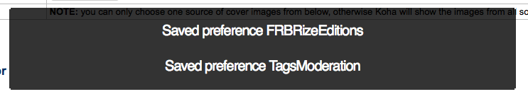
.. |image4| image:: images/admin/globalprefs/sortprefs.png
.. |image5| image:: images/admin/globalprefs/Google/2newproject.png

.. |image7| image:: images/admin/globalprefs/Google/4enable.png
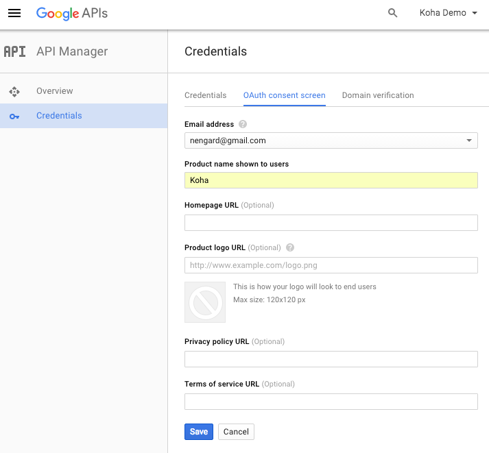
.. |image9| image:: images/admin/globalprefs/Google/6credtype.png
.. |image10| image:: images/admin/globalprefs/Google/7creds.png
.. |image11| image:: images/admin/globalprefs/Google/8oauth.png
.. |image12| image:: images/admin/globalprefs/Google/7creds.png
.. |image14| image:: images/admin/globalprefs/AuthDisplayHierarchy.png
.. |image15| image:: images/admin/globalprefs/hide_marc-display.png
.. |image16| image:: images/admin/globalprefs/hide_marc-dont.png
.. |image17| image:: images/admin/globalprefs/LabelMARCView-do.png
.. |image18| image:: images/admin/globalprefs/LabelMARCView-dont.png
.. |image19| image:: images/admin/globalprefs/SeparateHoldings.png
.. |image20| image:: images/admin/globalprefs/advancedMARCeditor-display.png
.. |image21| image:: images/admin/globalprefs/advancedMARCeditor-dontdisplay.png
.. |image22| image:: images/admin/globalprefs/AlternateHoldingsField.png
.. |image23| image:: images/admin/globalprefs/item-level_itypes.png
.. |image24| image:: images/admin/globalprefs/SpineLabelShowPrintOnBibDetails.png

.. |image27| image:: images/admin/globalprefs/AllowTooManyOverride-yes.png
.. |image28| image:: images/admin/globalprefs/AllowTooManyOverride-no.png
.. |image29| image:: images/admin/globalprefs/IssueLostItem-msg.png
.. |image30| image:: images/admin/globalprefs/IssueLostItem-confirm.png

.. |image32| image:: images/admin/globalprefs/decreaseLoanHighHoldsDuration.png
.. |image33| image:: images/admin/globalprefs/CircAutocompl.png
.. |image34| image:: images/admin/globalprefs/FilterBeforeOverdueReport.png

.. |image36| image:: images/admin/globalprefs/DisplayClearScreenButtonOff.png

.. |image38| image:: images/admin/globalprefs/ExportRemoveFields.png
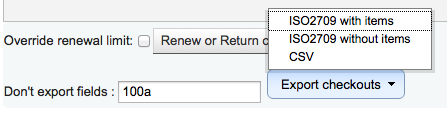
.. |image40| image:: images/admin/globalprefs/itemBarcodeFallbackSearch.png
.. |image41| image:: images/admin/globalprefs/SpecifyDueDate.png
.. |image42| image:: images/admin/globalprefs/SpecifyDueDate-no.png
.. |image43| image:: images/admin/globalprefs/WaitingNotifyAtCheckin.png
.. |image44| image:: images/circ/selfcheckout.png
.. |image45| image:: images/circ/SelfCheckoutByLogin.png

.. |image47| image:: images/admin/globalprefs/editions.png
.. |image48| image:: images/admin/globalprefs/Babeltheque.png
.. |image49| image:: images/admin/globalprefs/HTML5MediaEnabled-opac.png
.. |image50| image:: images/admin/globalprefs/HTML5MediaEnabled-staff.png
.. |image51| image:: images/admin/globalprefs/IDreamBooksReadometer.png

.. |image53| image:: images/admin/globalprefs/IDreamBooksReviews.png
.. |image54| image:: images/admin/globalprefs/AllowMultipleCovers.png
.. |image55| image:: images/admin/globalprefs/novelisttab.png
.. |image56| image:: images/admin/globalprefs/novelistside.png
.. |image57| image:: images/admin/globalprefs/Overdrive.png
.. |image58| image:: images/admin/globalprefs/TagsInputOnList.png
.. |image59| image:: images/admin/globalprefs/TagsInputOnDetail.png
.. |image60| image:: images/admin/globalprefs/alphabet.png
.. |image61| image:: images/admin/globalprefs/opaclanguagesdisplay.png

.. |image63| image:: images/admin/globalprefs/hidelostitems.png
.. |image64| image:: images/admin/globalprefs/LibraryName.png
.. |image65| image:: images/admin/globalprefs/OpacAddMastheadLibraryPulldown-add.png

.. |image67| image:: images/admin/globalprefs/OPACBaseURL.png
.. |image68| image:: images/admin/globalprefs/opaccredits-html.png
.. |image69| image:: images/admin/globalprefs/opaccredits.png
.. |image70| image:: images/admin/globalprefs/OPACDisplay856uAsImage.png
.. |image71| image:: images/admin/globalprefs/856imagemarc.png

.. |image73| image:: images/admin/globalprefs/opacheader-html.png
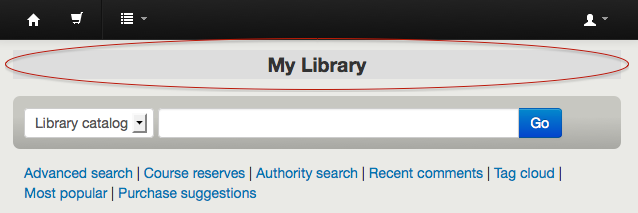
.. |image75| image:: images/admin/globalprefs/OpacKohaUrl.png
.. |image76| image:: images/admin/globalprefs/opacmaintenance.png

.. |image78| image:: images/admin/globalprefs/OPACMySummaryHTML.png
.. |image79| image:: images/admin/globalprefs/OpacNav.png
.. |image80| image:: images/admin/globalprefs/OpacNavBottom.png
.. |image82| image:: images/admin/globalprefs/OPACNoResultsFound.png
.. |image83| image:: images/admin/globalprefs/OpacSeparateHoldings.png
.. |image84| image:: images/admin/globalprefs/OPACShowBarcode-noshow.png
.. |image85| image:: images/admin/globalprefs/OPACShowBarcode-show.png
.. |image88| image:: images/admin/globalprefs/OpacShowRecentComments.png
.. |image89| image:: images/admin/globalprefs/OpacStarRatings-details.png
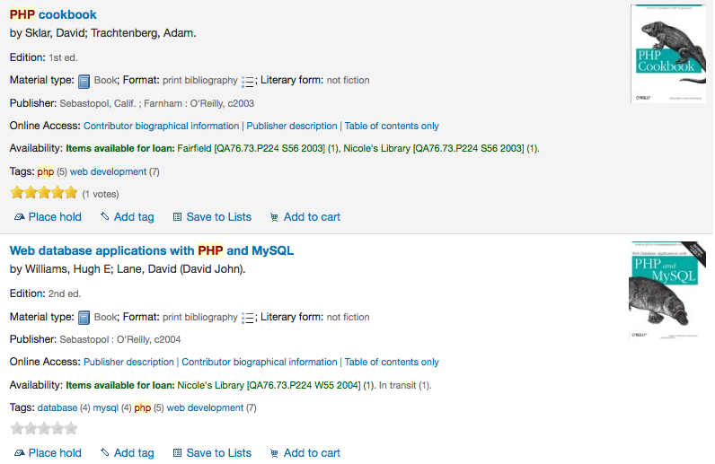
.. |image91| image:: images/admin/globalprefs/opacuserjs-before.png
.. |image92| image:: images/admin/globalprefs/opacuserjs.png
.. |image93| image:: images/admin/globalprefs/opacuserjs-after.png
.. |image94| image:: images/admin/globalprefs/authoritysearch.png
.. |image95| image:: images/admin/globalprefs/OpacBrowseResults.png
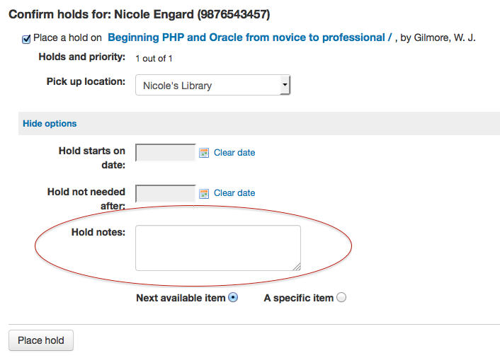
.. |image97| image:: images/admin/globalprefs/OPACPatronDetails.png
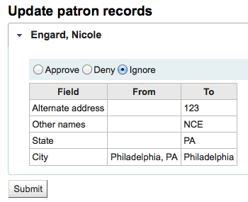
.. |image99| image:: images/admin/globalprefs/OpacTopissue.png
.. |image100| image:: images/admin/globalprefs/topissues.png

.. |image103| image:: images/admin/globalprefs/PatronSelfRegistration.png
.. |image104| image:: images/admin/globalprefs/OPACShelfBrowser.png
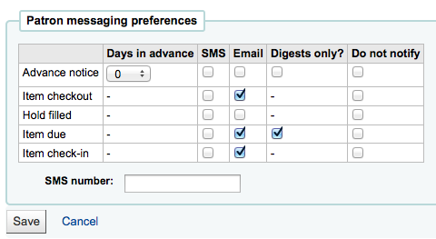
.. |image106| image:: images/admin/globalprefs/StatisticsFields.png
.. |image107| image:: images/admin/globalprefs/displayFacetCount.png
.. |image108| image:: images/admin/globalprefs/AdvancedSearchTypes.png
.. |image109| image:: images/admin/globalprefs/opacSerialDefaultTab-colltab.png
.. |image110| image:: images/admin/globalprefs/opacSerialDefaultTab-subtab.png
.. |image111| image:: images/admin/globalprefs/SubscriptionHistory-brief.png
.. |image112| image:: images/admin/globalprefs/SubscriptionHistory-full.png
.. |image113| image:: images/admin/globalprefs/Display856uAsImage.png
.. |image114| image:: images/admin/globalprefs/856imagemarc.png
.. |image115| image:: images/admin/globalprefs/DisplayIconsXSLT.png

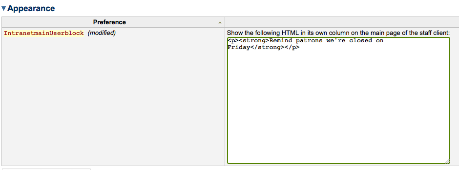
.. |image118| image:: images/admin/globalprefs/IntranetmainUserblock.png
.. |image119| image:: images/admin/globalprefs/XSLTDetailsDisplay-off.png
.. |image120| image:: images/admin/globalprefs/XSLTDetailsDisplay-on.png
.. |image121| image:: images/admin/globalprefs/StaffDetailItemSelection.png

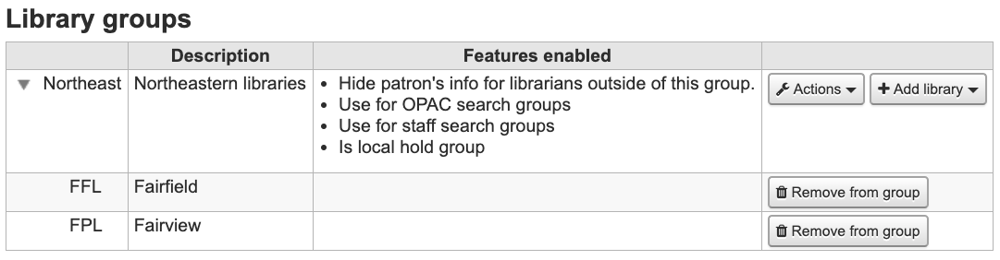
.. |image124| image:: images/admin/basicparams/newlibrary.png
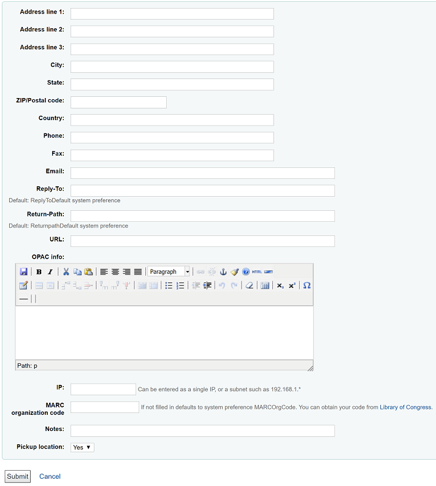

.. |image127| image:: images/admin/basicparams/opacinfo.png

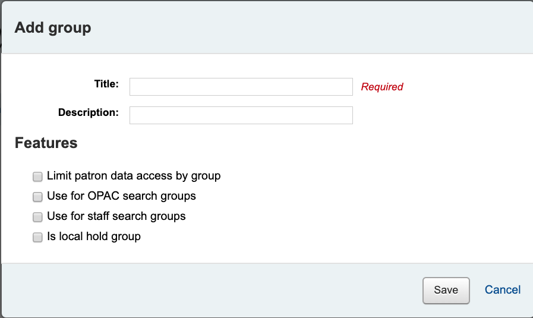
.. |image130| image:: images/admin/basicparams/searchgroup.png

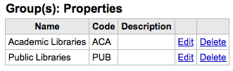
.. |image133| image:: images/admin/basicparams/addlibrarytogroup.png

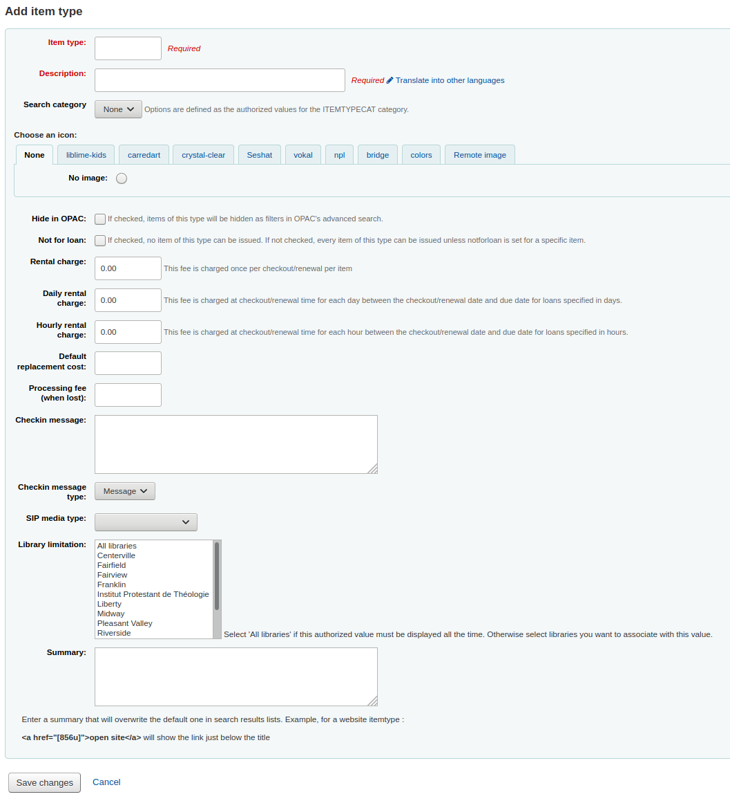
.. |image136| image:: images/admin/basicparams/itemtype-msgsetup.png
.. |image137| image:: images/admin/basicparams/itemtype-msg.png
.. |image138| image:: images/admin/basicparams/itemtype-alert.png

.. |image140| image:: images/admin/basicparams/nodeleteitemtype.png
.. |image141| image:: images/admin/basicparams/bor_notes.png
.. |image142| image:: images/admin/basicparams/report_group.png
.. |image143| image:: images/admin/basicparams/report_subgroup.png
.. |image144| image:: images/admin/basicparams/addauthcat.png
.. |image145| image:: images/admin/basicparams/authvallist.png

.. |image147| image:: images/admin/basicparams/authvals.png

.. |image150| image:: images/admin/patroncirc/patcaterror.png
.. |image151| image:: images/admin/patroncirc/patcaterror.png
.. |image152| image:: images/admin/patroncirc/patcaterror.png
.. |image153| image:: images/admin/patroncirc/hidelostitemspatron.png
.. |image154| image:: images/admin/patroncirc/patroncatpulldown.png
.. |image155| image:: images/admin/patroncirc/patcaterror.png
.. |image156| image:: images/admin/patroncirc/selectissuinglibrary.png

.. |image159| image:: images/admin/patroncirc/clonerules.png
.. |image160| image:: images/admin/patroncirc/rulescloned.png
.. |image161| image:: images/admin/patroncirc/defaultcheckholds.png
.. |image162| image:: images/admin/patroncirc/checkoutsperpatron.png
.. |image163| image:: images/admin/patroncirc/holdsperitem.png
.. |image164| image:: images/admin/patroncirc/attributes.png

.. |image166| image:: images/admin/patroncirc/showattribute.png
.. |image167| image:: images/admin/patroncirc/pa_class.png

.. |image169| image:: images/admin/patroncirc/pa_class-patron.png
.. |image170| image:: images/admin/patroncirc/deletepatronattr.png

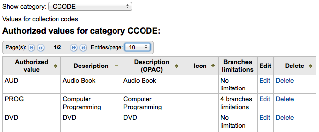
.. |image173| image:: images/admin/patroncirc/limittocollcode.png
.. |image174| image:: images/admin/patroncirc/transferlimits.png
.. |image175| image:: images/admin/patroncirc/transportcostmatrix.png
.. |image176| image:: images/admin/patroncirc/librariesforalert.png
.. |image177| image:: images/admin/patroncirc/alertmatrix.png
.. |image178| image:: images/admin/patroncirc/newcity.png
.. |image179| image:: images/admin/patroncirc/cities.png
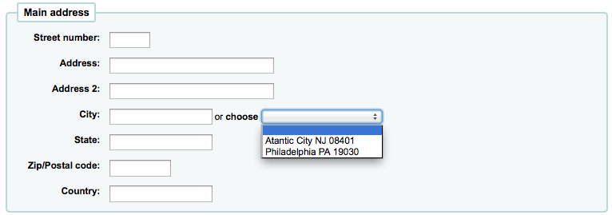

.. |image182| image:: images/admin/cataloging/frameworkoptions.png
.. |image183| image:: images/admin/cataloging/addframework.png
.. |image184| image:: images/admin/cataloging/startnewframework.png
.. |image185| image:: images/admin/cataloging/editframework.png

.. |image187| image:: images/admin/cataloging/newtagform.png
.. |image188| image:: images/admin/cataloging/subfieldslink.png

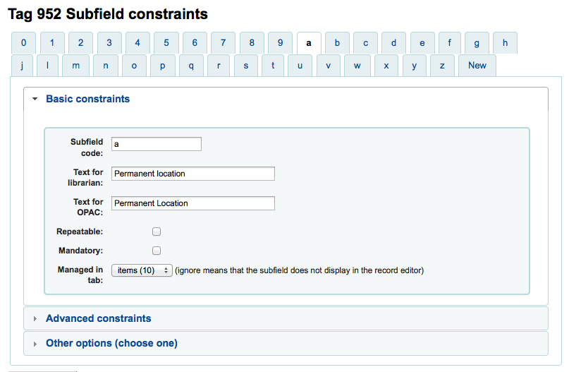
.. |image191| image:: images/admin/cataloging/advancedoptsubfield.png
.. |image192| image:: images/admin/cataloging/frameworkvisibility.png
.. |image193| image:: images/admin/cataloging/otheroptssubfield.png
.. |image194| image:: images/admin/cataloging/504auth.png
.. |image195| image:: images/admin/cataloging/importexport.png
.. |image196| image:: images/admin/cataloging/exportoptions.png
.. |image197| image:: images/admin/cataloging/importexport.png
.. |image198| image:: images/admin/cataloging/importfile.png
.. |image199| image:: images/admin/cataloging/importconfirm.png
.. |image200| image:: images/admin/cataloging/importtimer.png

.. |image202| image:: images/admin/cataloging/mapmarc.png
.. |image206| image:: images/admin/cataloging/frameworktest.png
.. |image207| image:: images/admin/cataloging/classsources.png
.. |image208| image:: images/admin/cataloging/addclasssource.png
.. |image209| image:: images/admin/cataloging/newmatchrule.png
.. |image210| image:: images/admin/cataloging/samplematchrule.png

.. |image213| image:: images/admin/acquisitions/nocurrency.png
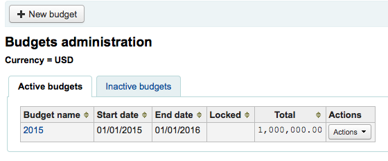
.. |image215| image:: images/admin/acquisitions/newbudgetform.png

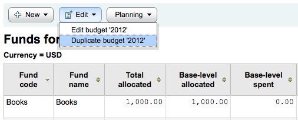
.. |image219| image:: images/admin/acquisitions/duplicatestartend.png
.. |image220| image:: images/admin/acquisitions/closereport.png
.. |image221| image:: images/admin/acquisitions/newfund.png
.. |image222| image:: images/admin/acquisitions/newfundform.png

.. |image224| image:: images/admin/acquisitions/fundlist.png
.. |image225| image:: images/admin/acquisitions/fundactions.png

.. |image227| image:: images/admin/acquisitions/planningpulldown.png
.. |image228| image:: images/admin/acquisitions/planningbymonths.png
.. |image229| image:: images/admin/acquisitions/addplanningcol.png
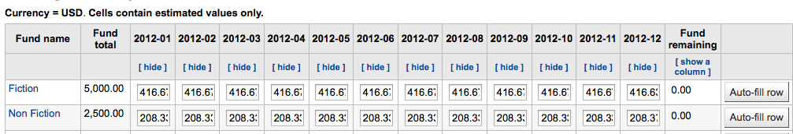
.. |image231| image:: images/admin/acquisitions/planningcsv.png
.. |image232| image:: images/admin/additional/z39list.png
.. |image233| image:: images/admin/additional/newz39.png

.. |image235| image:: images/admin/additional/didyoumean.png
.. |image236| image:: images/admin/additional/didyoumeandrag.png
.. |image237| image:: images/admin/additional/didyoumeanopacexplode.png
.. |image238| image:: images/admin/additional/didyoumeanopacauth.png
.. |image239| image:: images/admin/additional/columns.png

.. |image241| image:: images/admin/additional/currenciesnohide.png

.. |image243| image:: images/admin/additional/currencieshide.png
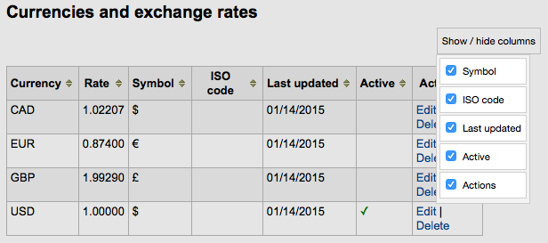
.. |image245| image:: images/tools/patronlists/patronlists.png

.. |image247| image:: images/tools/patronlists/addtopatronlist.png
.. |image248| image:: images/tools/patronlists/addpatrontolist.png

.. |image251| image:: images/tools/comments/commentswaiting.png
.. |image252| image:: images/tools/comments/commentmoderation.png

.. |image254| image:: images/tools/comments/commentapproved.png

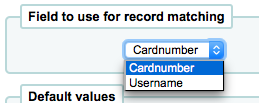
.. |image257| image:: images/tools/importpatrons/patronmatching.png
.. |image258| image:: images/tools/notices/notices.png
.. |image259| image:: images/tools/notices/newnotice.png
.. |image260| image:: images/tools/triggers.png
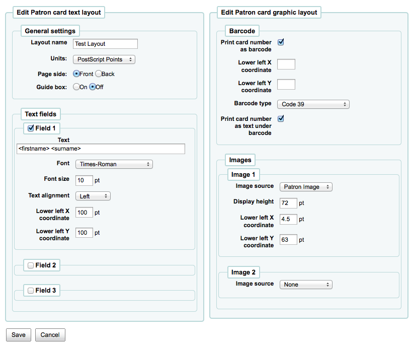

.. |image265| image:: images/tools/patroncards/edittemplate.png

.. |image268| image:: images/tools/patroncards/newprofile.png
.. |image269| image:: images/tools/patroncards/addprofile.png

.. |image271| image:: images/tools/patroncards/manageprofiles.png
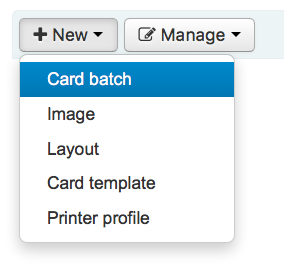
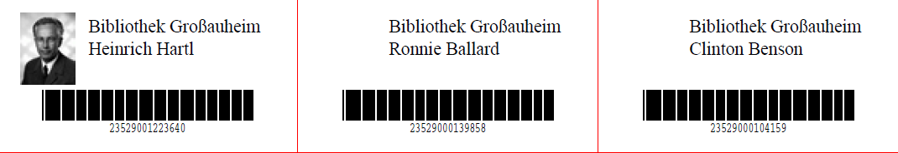
.. |image274| image:: images/tools/patroncards/imageupload.png
.. |image275| image:: images/tools/patroncards/imageuploaded.png
.. |image276| image:: images/tools/patroncards/imagedelete.png
.. |image277| image:: images/tools/anonymize/patronbulkdelete.png
.. |image278| image:: images/tools/anonymize/patronanonconfirm.png
.. |image279| image:: images/tools/anonymize/patronanoncomplete.png
.. |image280| image:: images/tools/batchpatron/batchmodify.png

.. |image283| image:: images/tools/tagging/pendingtags.png
.. |image284| image:: images/tools/tagging/tagpending.png
.. |image285| image:: images/tools/tagging/tagsummary.png
.. |image286| image:: images/tools/tagging/tagapproved.png
.. |image287| image:: images/tools/tagging/tagblacklisttest-neither.png
.. |image288| image:: images/tools/tagging/tagfilters.png
.. |image289| image:: images/tools/patronphotos/uploadphotosfile.png
.. |image290| image:: images/tools/patronphotos/uploadimagetool.png
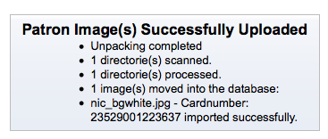
.. |image292| image:: images/tools/rotatingcollections/rotatingcollectionnotice.png
.. |image293| image:: images/tools/batchmod/batchmod.png
.. |image294| image:: images/tools/batchmod/batchmodsummary.png

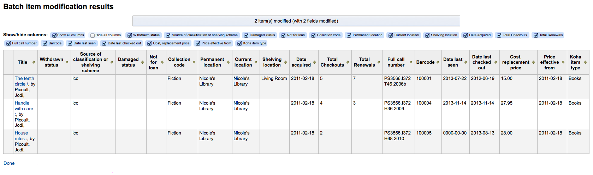
.. |image297| image:: images/tools/batchmod/editinbatch.png
.. |image298| image:: images/tools/batchdelete/batchdel.png
.. |image299| image:: images/tools/batchdelete/confirmbatchdel.png
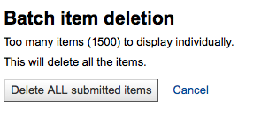
.. |image301| image:: images/tools/batchdelete/nobatchdel.png
.. |image302| image:: images/tools/batchdelete/batchdeldone.png
.. |image303| image:: images/tools/batchbibmod/batchbibmod1.png
.. |image304| image:: images/tools/autoitemmodage/savedrule.png
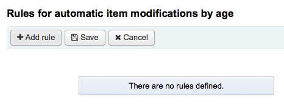
.. |image306| image:: images/tools/autoitemmodage/ruleform.png
.. |image307| image:: images/tools/autoitemmodage/savedrule.png

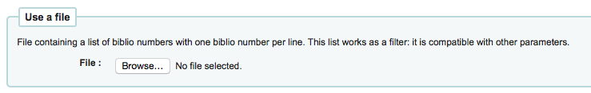
.. |image310| image:: images/tools/exportmarc/marcexport-pt2.png

.. |image312| image:: images/tools/exportmarc/authexport-pt1.png
.. |image313| image:: images/tools/exportmarc/authexport-pt2.png
.. |image314| image:: images/tools/exportmarc/authexport-pt3.png

.. |image316| image:: images/tools/inventory/shelflist.png

.. |image319| image:: images/tools/labelcreator/labelform.png

.. |image321| image:: images/tools/labelcreator/labeltemplates.png
.. |image322| image:: images/tools/labelcreator/newprofile.png
.. |image323| image:: images/tools/labelcreator/newprofileform.png

.. |image325| image:: images/tools/labelcreator/profiles.png
.. |image326| image:: images/tools/labelcreator/newlayout.png

.. |image329| image:: images/tools/labelcreator/labelfromstaged.png

.. |image331| image:: images/tools/labelcreator/addbatchitems.png
.. |image332| image:: images/tools/labelcreator/searchforbatch.png
.. |image333| image:: images/tools/labelcreator/batchsearchresults.png
.. |image334| image:: images/tools/labelcreator/itemsinbarch.png
.. |image335| image:: images/tools/labelcreator/exportbatch.png
.. |image336| image:: images/tools/labelcreator/savebatch.png
.. |image337| image:: images/tools/quickspinelable.png

.. |image339| image:: images/tools/marcmodtemplates/ifexample.png
.. |image340| image:: images/tools/marcmodtemplates/regexexample.png
.. |image341| image:: images/tools/marcmodtemplates/viewactions.png
.. |image342| image:: images/tools/marcmodtemplates/duplicate.png
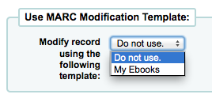
.. |image344| image:: images/tools/marcimport/stagemarc-pt1.png
.. |image345| image:: images/tools/marcimport/stagemarc-pt2.png
.. |image346| image:: images/tools/marcimport/recordtype.png
.. |image347| image:: images/tools/marcimport/encoding.png
.. |image348| image:: images/tools/marcimport/templatechoice.png
.. |image349| image:: images/tools/marcimport/matches.png
.. |image350| image:: images/tools/marcimport/matchrule.png
.. |image351| image:: images/tools/marcimport/checkitems.png
.. |image352| image:: images/tools/marcimport/stagemarc-results.png
.. |image353| image:: images/tools/marcimport/managestaged.png

.. |image355| image:: images/tools/marcimport/importframework.png
.. |image356| image:: images/tools/marcimport/stagedrecords.png
.. |image357| image:: images/tools/marcimport/matchfound.png
.. |image358| image:: images/tools/marcimport/stagediff.png
.. |image359| image:: images/tools/marcimport/importedrecords.png
.. |image360| image:: images/tools/marcimport/reservoirresults.png
.. |image361| image:: images/tools/marcimport/managestaged.png
.. |image362| image:: images/tools/marcimport/cleanbatch.png
.. |image363| image:: images/tools/uploadlocalimg/uploadsingle.png
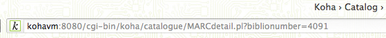
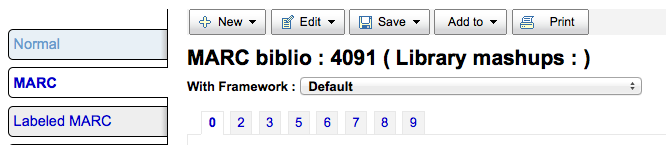
.. |image366| image:: images/tools/uploadlocalimg/zipfiles.png

.. |image368| image:: images/admin/globalprefs/AllowMultipleCovers.png

.. |image370| image:: images/tools/calendar/calendaradd.png

.. |image372| image:: images/tools/calendar/calendarsummary.png
.. |image373| image:: images/tools/calendar/calendaredit.png
.. |image374| image:: images/tools/calendar/calendarexception.png
.. |image375| image:: images/tools/calendar/calendarhelp.png

.. |image377| image:: images/tools/csvprofiles/addcsv-sql.png
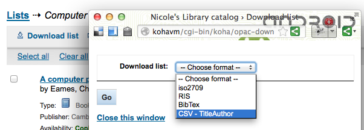
.. |image379| image:: images/tools/csvprofiles/csvfieldsep.png
.. |image380| image:: images/tools/csvprofiles/csvadded.png
.. |image381| image:: images/tools/csvprofiles/modifycsv.png

.. |image383| image:: images/tools/csvprofiles/deletecsv.png

.. |image385| image:: images/tools/logs/logviewer.png

.. |image390| image:: images/tools/news/librariannews.png
.. |image391| image:: images/tools/news/slipnews.png
.. |image392| image:: images/tools/tasksched/taskscheduler.png
.. |image393| image:: images/tools/tasksched/scheduledreports.png
.. |image394| image:: images/tools/tasksched/savedreports.png

.. |image396| image:: images/tools/qotd/quotebuttons.png
.. |image397| image:: images/tools/qotd/addquote.png
.. |image398| image:: images/tools/qotd/editquote.png
.. |image399| image:: images/tools/qotd/quotebuttons.png
.. |image400| image:: images/tools/qotd/importquotes.png
.. |image401| image:: images/tools/qotd/importedsummary.png
.. |image402| image:: images/tools/qotd/editimported.png
.. |image403| image:: images/tools/qotd/selectfordelete.png
.. |image404| image:: images/tools/qotd/importquotebuttons.png
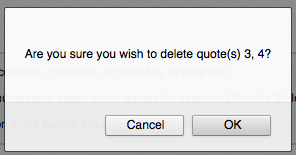
.. |image406| image:: images/tools/qotd/importquotebuttons.png
.. |image407| image:: images/patrons/newpatron.png
.. |image408| image:: images/patrons/addpatronform.png
.. |image409| image:: images/patrons/addcontact.png
.. |image410| image:: images/patrons/addGuarantor.png
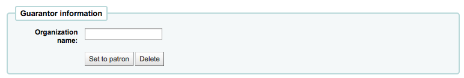
.. |image412| image:: images/patrons/addaltcontact.png

.. |image416| image:: images/patrons/addattributes.png
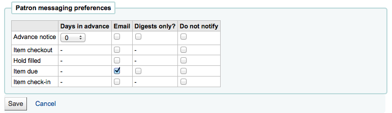
.. |image418| image:: images/patrons/duplicatewarn.png
.. |image419| image:: images/patrons/patronagelimit.png
.. |image420| image:: images/patrons/statspatcat.png
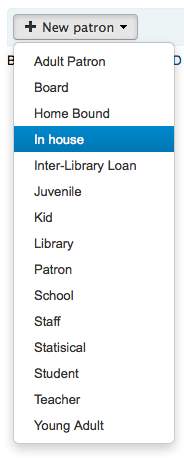
.. |image422| image:: images/patrons/patronedit.png
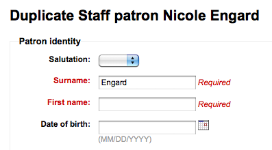
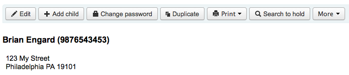
.. |image425| image:: images/patrons/addpatronimage.png
.. |image426| image:: images/patrons/patronimage.png
.. |image427| image:: images/patrons/patronedit.png
.. |image428| image:: images/patrons/patronpassword.png

.. |image430| image:: images/patrons/patronaddimage.png

.. |image432| image:: images/patrons/patronaddress.png

.. |image434| image:: images/patrons/addpatronrestriction.png
.. |image435| image:: images/patrons/restricteduntil.png
.. |image436| image:: images/patrons/updatetoadult.png
.. |image437| image:: images/patrons/choosadulttype.png
.. |image438| image:: images/patrons/pendingpatronrequest.png
.. |image439| image:: images/patrons/managepatronupdates.png
.. |image440| image:: images/patrons/editpatronpermissions.png
.. |image441| image:: images/patrons/GranularPermissions.png
.. |image442| image:: images/patrons/myaccount.png
.. |image443| image:: images/patrons/child.png
.. |image444| image:: images/patrons/parent.png

.. |image446| image:: images/patrons/relativecheckouts.png

.. |image448| image:: images/patrons/patronrestrictions.png
.. |image449| image:: images/patrons/addrestriction.png

.. |image452| image:: images/patrons/payfine.png
.. |image453| image:: images/patrons/paypartial.png
.. |image454| image:: images/patrons/payamount.png
.. |image455| image:: images/patrons/payselected-select.png
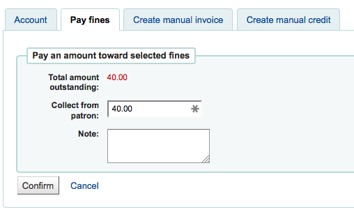
.. |image457| image:: images/patrons/reverselink.png
.. |image458| image:: images/patrons/reversed.png
.. |image459| image:: images/patrons/manualinvoice.png
.. |image460| image:: images/patrons/manualcredit.png
.. |image461| image:: images/patrons/patroninvoice.png
.. |image462| image:: images/patrons/routinglisttab.png
.. |image463| image:: images/patrons/patronroutinglists.png

.. |image465| image:: images/patrons/readinghistory-export.png
.. |image466| image:: images/patrons/borrowerlog.png
.. |image467| image:: images/patrons/patnoticestab.png
.. |image468| image:: images/patrons/patnoticestab-full.png

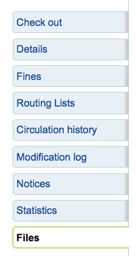
.. |image472| image:: images/patrons/nopatronfiles.png
.. |image473| image:: images/patrons/patronfileslist.png
.. |image474| image:: images/patrons/generatedischarge.png
.. |image475| image:: images/patrons/cantdischarge.png
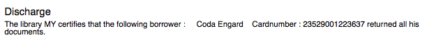
.. |image477| image:: images/patrons/patronsearch.png
.. |image478| image:: images/patrons/patronsearchexpand.png
.. |image479| image:: images/patrons/patronfieldsearch.png
.. |image480| image:: images/patrons/patronsearchcontains.png
.. |image481| image:: images/patrons/patronbrowse.png
.. |image482| image:: images/circ/checkoutmain.png
.. |image483| image:: images/circ/checkoutpatron.png
.. |image484| image:: images/circ/circquickbox.png
.. |image485| image:: images/circ/checkingout-noshow.png

.. |image487| image:: images/circ/checkoutsummary.png
.. |image488| image:: images/circ/onsitecheckout.png
.. |image489| image:: images/circ/exportcheckouts.png
.. |image490| image:: images/circ/holdssummary.png
.. |image491| image:: images/circ/patronnotes.png

.. |image494| image:: images/circ/printslip.png

.. |image496| image:: images/circ/batchcheckoutwarn.png
.. |image497| image:: images/circ/batchlocaluse.png
.. |image498| image:: images/circ/materialspecified.png
.. |image499| image:: images/circ/fineswarning.png

.. |image502| image:: images/circ/addresswarning.png

.. |image504| image:: images/circ/warnings/patrondebt.png
.. |image505| image:: images/circ/warnings/onhold.png
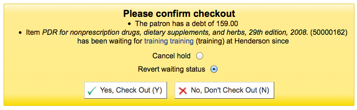
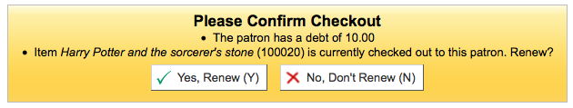
.. |image508| image:: images/circ/warnings/checkedoutelse.png
.. |image509| image:: images/circ/warnings/notforloan.png
.. |image510| image:: images/circ/warnings/toomanycheckouts.png
.. |image511| image:: images/circ/warnings/toomanycheckouts-no.png
.. |image512| image:: images/circ/warnings/norenewals.png
.. |image513| image:: images/circ/barcodefastadd.png
.. |image514| image:: images/circ/lostitemmsg.png
.. |image515| image:: images/circ/lostitemconfirm.png

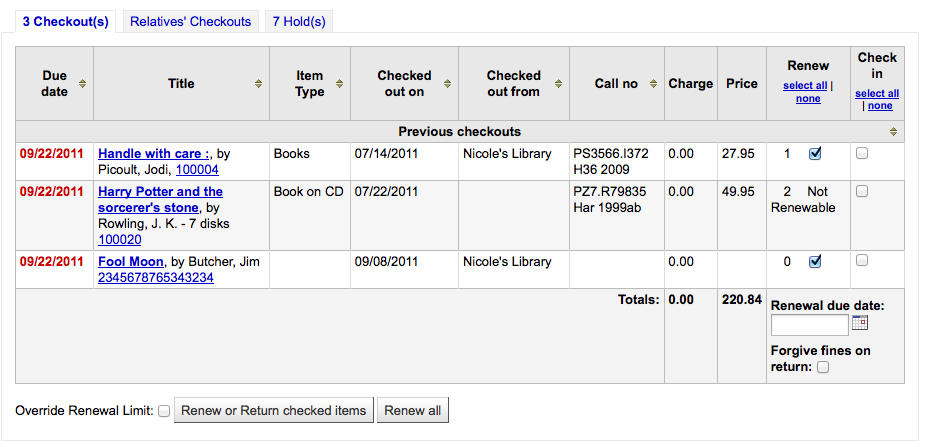
.. |image519| image:: images/circ/renewbutton.png
.. |image520| image:: images/circ/overriderenew.png
.. |image521| image:: images/circ/renewcirc.png
.. |image522| image:: images/circ/renewbarcode.png
.. |image523| image:: images/circ/renewed.png
.. |image524| image:: images/circ/renewnomatch.png

.. |image526| image:: images/circ/checkinmain.png
.. |image527| image:: images/circ/checkinquickbox.png
.. |image528| image:: images/circ/checkinlink.png

.. |image531| image:: images/circ/checkintransfer.png

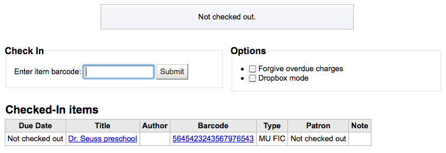
.. |image534| image:: images/circ/materialspecified.png
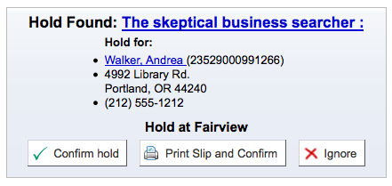
.. |image536| image:: images/circ/waitingstatus.png

.. |image538| image:: images/circ/intransithold.png

.. |image540| image:: images/circ/bor_notes.png
.. |image541| image:: images/circ/staffmessages.png
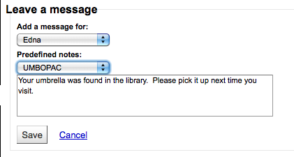
.. |image543| image:: images/circ/staffmessages.png
.. |image544| image:: images/circ/opacmsg.png

.. |image546| image:: images/circ/placeholdsearch.png
.. |image547| image:: images/circ/placeholdfindpatron.png
.. |image548| image:: images/circ/searchtohold.png
.. |image549| image:: images/circ/holdresults.png
.. |image550| image:: images/circ/holdmultiresults.png
.. |image551| image:: images/circ/placeholdsingle.png
.. |image552| image:: images/circ/placeholdmultiple.png
.. |image553| image:: images/circ/forgethold.png
.. |image554| image:: images/circ/holdtab.png
.. |image555| image:: images/circ/holdslist.png
.. |image556| image:: images/circ/holdpriority.png
.. |image557| image:: images/circ/lowestpriority.png
.. |image558| image:: images/circ/suspendholds.png
.. |image559| image:: images/circ/cancelholds.png

.. |image561| image:: images/circ/holdconfirm.png
.. |image563| image:: images/circ/holditem.png
.. |image564| image:: images/circ/holdwaitingwarn.png
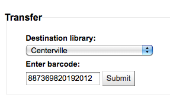

.. |image567| image:: images/circ/itemintransit.png
.. |image568| image:: images/circ/itemlocations.png
.. |image569| image:: images/circ/mylibrary.png

.. |image572| image:: images/circ/fastadd.png
.. |image573| image:: images/circ/barcodefastadd.png
.. |image574| image:: images/circ/fastaddbarcode.png

.. |image576| image:: images/circ/fastaddcheckedout.png
.. |image577| image:: images/circ/holdsqueue.png

.. |image581| image:: images/circ/holdspickupover.png

.. |image584| image:: images/circ/transferlate.png

.. |image586| image:: images/circ/overduewfines.png

.. |image588| image:: images/circ/localuserecorded.png
.. |image589| image:: images/circ/localusecheckin.png
.. |image590| image:: images/circ/LOCvalues.png
.. |image591| image:: images/circ/selfcheckoutlink.png
.. |image592| image:: images/circ/selfcheckout.png
.. |image593| image:: images/circ/SelfCheckoutByLogin.png
.. |image594| image:: images/circ/selfcheckoutuser.png
.. |image595| image:: images/circ/selfcheckoutsummary.png
.. |image596| image:: images/circ/selfreceiptprint.png

.. |image598| image:: images/circ/offlinecirc.png
.. |image599| image:: images/circ/syncoffline.png
.. |image600| image:: images/circ/downloadoffline.png
.. |image601| image:: images/circ/offlinecheckout.png
.. |image602| image:: images/circ/offlineduedate.png
.. |image603| image:: images/circ/offlinecheckouts.png
.. |image604| image:: images/circ/offlineupload.png
.. |image605| image:: images/circ/viewkohaoffline.png
.. |image606| image:: images/circ/offlinecirclog.png
.. |image607| image:: images/circ/offlinecircsuccess.png
.. |image608| image:: images/circ/koctstatusbar.png
.. |image609| image:: images/circ/koct.png
.. |image610| image:: images/circ/koctwarn.png
.. |image611| image:: images/circ/koctparam.png
.. |image612| image:: images/circ/koct.png
.. |image613| image:: images/circ/koctcheckin.png
.. |image614| image:: images/circ/koctcount.png
.. |image615| image:: images/circ/koctlog.png
.. |image616| image:: images/circ/offlinecirclink.png
.. |image617| image:: images/circ/offlinecirclog.png
.. |image618| image:: images/circ/offlinecircsuccess.png
.. |image619| image:: images/circ/koctdirectly.png
.. |image620| image:: images/circ/koctwarn.png
.. |image621| image:: images/circ/offlinecirclink.png
.. |image622| image:: images/circ/uploadofflinecirc.png
.. |image623| image:: images/circ/processoffline.png
.. |image624| image:: images/circ/offlinesummary.png
.. |image625| image:: images/circ/offlinecirclog.png
.. |image626| image:: images/circ/offlinecircsuccess.png

.. |image628| image:: images/cataloging/zsearch.png
.. |image629| image:: images/cataloging/zsearchresults.png
.. |image631| image:: images/cataloging/tryanotherzsearch.png
.. |image632| image:: images/cataloging/addmarc.png
.. |image633| image:: images/cataloging/lockedauthority.png
.. |image634| image:: images/cataloging/catauthoritysearch.png
.. |image635| image:: images/cataloging/catauthoritysearchresults.png
.. |image636| image:: images/cataloging/dupfield.png
.. |image637| image:: images/cataloging/clonesubfield.png
.. |image638| image:: images/cataloging/leaderbuilder.png
.. |image639| image:: images/cataloging/008plugin.png
.. |image640| image:: images/cataloging/savecataloging.png
.. |image641| image:: images/cataloging/duprecordwarn.png
.. |image642| image:: images/cataloging/advancedzresults.png

.. |image644| image:: images/cataloging/advancedcataloging.png
.. |image645| image:: images/cataloging/advancedkeyshort.png

.. |image647| image:: images/cataloging/analyticsbarcode.png

.. |image649| image:: images/cataloging/analytics773.png
.. |image650| image:: images/cataloging/analyticstab.png
.. |image651| image:: images/cataloging/anayticbib.png
.. |image652| image:: images/cataloging/hostrecords.png
.. |image653| image:: images/cataloging/analyticschildlink.png
.. |image654| image:: images/cataloging/analytics773child.png
.. |image655| image:: images/cataloging/analyticstab.png
.. |image656| image:: images/cataloging/anayticbib.png
.. |image657| image:: images/cataloging/hostrecords.png
.. |image658| image:: images/cataloging/analyticdelink.png

.. |image660| image:: images/cataloging/editrecord.png
.. |image661| image:: images/cataloging/editingrecord.png
.. |image662| image:: images/cataloging/replaceviaz39.png
.. |image663| image:: images/cataloging/uploadimage.png

.. |image667| image:: images/lists/mergerecs.png
.. |image668| image:: images/lists/nondupfield.png
.. |image669| image:: images/lists/mergereportvalues.png
.. |image670| image:: images/lists/mergeblankreport.png
.. |image671| image:: images/lists/mergereport.png
.. |image672| image:: images/cataloging/deleterecord.png
.. |image673| image:: images/cataloging/nodeleterecord.png

.. |image677| image:: images/cataloging/requireditemfields.png
.. |image678| image:: images/cataloging/additembuttons.png

.. |image680| image:: images/cataloging/items-withoutlabelprint.png
.. |image681| image:: images/cataloging/items-withlabelprint.png
.. |image682| image:: images/cataloging/items-activatefilters.png

.. |image685| image:: images/cataloging/itemstab.png
.. |image686| image:: images/cataloging/edititemlinkfromtab.png
.. |image687| image:: images/cataloging/editinbatch.png
.. |image688| image:: images/cataloging/editwithitemchecks.png
.. |image689| image:: images/cataloging/quickitemedit.png

.. |image691| image:: images/cataloging/editdamagedstatus.png

.. |image693| image:: images/cataloging/quickitemedit.png
.. |image694| image:: images/cataloging/itemorderinfo.png
.. |image695| image:: images/cataloging/attachitem.png

.. |image697| image:: images/cataloging/edititemstodelete.png
.. |image698| image:: images/cataloging/deleteitemlink.png
.. |image699| image:: images/cataloging/editwithitemchecks.png
.. |image700| image:: images/cataloging/itemstab-long.png
.. |image701| image:: images/cataloging/itemspecifichistory.png
.. |image702| image:: images/cataloging/newauthtypes.png
.. |image703| image:: images/cataloging/newauthrec.png
.. |image704| image:: images/cataloging/creatnewauthfromlink.png
.. |image705| image:: images/cataloging/authrelationships.png
.. |image706| image:: images/cataloging/authzsearch.png
.. |image707| image:: images/cataloging/authimport.png
.. |image708| image:: images/cataloging/authorityimported.png
.. |image709| image:: images/cataloging/authoritysearch.png

.. |image711| image:: images/cataloging/authrecord.png
.. |image712| image:: images/cataloging/authoritiesseealso.png
.. |image713| image:: images/cataloging/editauthority.png
.. |image714| image:: images/cataloging/dupauth.png

.. |image716| image:: images/cataloging/authmergechoice.png
.. |image717| image:: images/cataloging/authmerging.png
.. |image718| image:: images/cataloging/authmerged.png
.. |image719| image:: images/appendix-onorder/marcbreaker.png
.. |image720| image:: images/appendix-onorder/marcbreaker-summary.png
.. |image721| image:: images/appendix-onorder/editrecords.png

.. |image723| image:: images/appendix-onorder/add942.png
.. |image724| image:: images/appendix-onorder/add952.png
.. |image725| image:: images/appendix-onorder/compile.png

.. |image728| image:: images/coursereserves/instructorsearch.png
.. |image729| image:: images/coursereserves/instructorremove.png

.. |image733| image:: images/coursereserves/addbarcode.png

.. |image735| image:: images/coursereserves/courselinkopac.png

.. |image738| image:: images/serials/frequencies.png

.. |image740| image:: images/serials/numpatterns.png
.. |image741| image:: images/serials/newnumpattern.png

.. |image743| image:: images/serials/newsubbutton.png
.. |image744| image:: images/serials/addsub.png

.. |image746| image:: images/serials/newasdup.png
.. |image747| image:: images/serials/addsub2.png
.. |image748| image:: images/serials/advancedpattern.png

.. |image751| image:: images/serials/subbuttons.png
.. |image752| image:: images/serials/serialcolllink.png
.. |image753| image:: images/serials/editissue.png
.. |image754| image:: images/serials/receiveissue.png
.. |image755| image:: images/serials/serialitem.png
.. |image756| image:: images/serials/editissue.png

.. |image759| image:: images/serials/addtorouting.png
.. |image760| image:: images/serials/editroutinglist.png
.. |image761| image:: images/serials/previewroutinglist.png
.. |image762| image:: images/serials/subinfoonbib.png
.. |image763| image:: images/serials/subscriptiondetail.png
.. |image764| image:: images/acquisitions/subdetails.png

.. |image766| image:: images/serials/compactopac.png

.. |image770| image:: images/serials/serialclaimmenu1.png
.. |image771| image:: images/serials/noserialclaim.png
.. |image772| image:: images/serials/serialclaims.png
.. |image773| image:: images/serials/serialexpiresearch.png
.. |image774| image:: images/serials/serialexpire.png
.. |image775| image:: images/serials/renewsubscription.png
.. |image776| image:: images/serials/collectionrenew.png
.. |image777| image:: images/serials/serialrenew.png
.. |image778| image:: images/serials/serialsearch.png
.. |image779| image:: images/serials/advanceserialsearch.png
.. |image780| image:: images/serials/serialsearchresults.png
.. |image781| image:: images/acquisitions/acqfunds.png
.. |image782| image:: images/acquisitions/fundbreakdown.png
.. |image783| image:: images/acquisitions/newvendbutton.png

.. |image785| image:: images/acquisitions/newvendor2.png

.. |image787| image:: images/acquisitions/vendorsearch.png
.. |image788| image:: images/acquisitions/vendorpage.png

.. |image790| image:: images/acquisitions/newcontract.png
.. |image791| image:: images/acquisitions/newcontractform.png

.. |image793| image:: images/acquisitions/contractonbasket.png
.. |image794| image:: images/acquisitions/suggestonacq.png
.. |image795| image:: images/acquisitions/pendingsuggestions.png
.. |image796| image:: images/acquisitions/suggestmanage.png
.. |image797| image:: images/acquisitions/suggestionsfilters.png

.. |image799| image:: images/acquisitions/suggestpending.png

.. |image801| image:: images/acquisitions/editsuggestion.png
.. |image802| image:: images/acquisitions/suggestreasons.png
.. |image803| image:: images/acquisitions/suggestothers.png
.. |image804| image:: images/acquisitions/mysuggestions.png

.. |image809| image:: images/acquisitions/orderfromexisting.png

.. |image812| image:: images/acquisitions/orderfromsuggestform.png

.. |image814| image:: images/acquisitions/subordersearch.png

.. |image817| image:: images/acquisitions/fromnewemptyrecord.png

.. |image820| image:: images/acquisitions/dupwarning.png
.. |image821| image:: images/acquisitions/orderz39form.png

.. |image823| image:: images/acquisitions/itemonorder.png
.. |image824| image:: images/acquisitions/itemonorderadded.png

.. |image826| image:: images/acquisitions/fundconfirmation.png

.. |image829| image:: images/acquisitions/cantdeleteorderline.png
.. |image830| image:: images/acquisitions/basketbuttons.png

.. |image835| image:: images/acquisitions/closebasket.png

.. |image838| image:: images/acquisitions/pdforder.png

.. |image842| image:: images/acquisitions/receiptsummary.png

.. |image845| image:: images/acquisitions/received.png

.. |image851| image:: images/acquisitions/invoicesearch.png

.. |image856| image:: images/acquisitions/mergeinvoices.png

.. |image858| image:: images/acquisitions/lateorders.png
.. |image859| image:: images/acquisitions/claimletter.png
.. |image860| image:: images/acquisitions/acqsearches.png
.. |image861| image:: images/acquisitions/vendorquicksearch.png
.. |image862| image:: images/acquisitions/ordersearch.png
.. |image863| image:: images/acquisitions/ordersearchresults.png
.. |image864| image:: images/acquisitions/ordersearchexpand.png
.. |image865| image:: images/acquisitions/ordersearchfull.png
.. |image866| image:: images/acquisitions/acqfunds.png

.. |image869| image:: images/lists/newlistform.png
.. |image870| image:: images/lists/newlistsearch.png
.. |image871| image:: images/lists/newlistfromsearch.png

.. |image873| image:: images/lists/listcontents.png

.. |image876| image:: images/lists/listcontents.png
.. |image877| image:: images/lists/listofdups.png
.. |image878| image:: images/lists/addtocart.png
.. |image879| image:: images/lists/itemsaddedcart.png

.. |image881| image:: images/reports/report1.png
.. |image882| image:: images/reports/report2.png
.. |image883| image:: images/reports/report3.png

.. |image885| image:: images/reports/report5.png
.. |image886| image:: images/reports/report6.png
.. |image887| image:: images/reports/reportconfirm.png

.. |image889| image:: images/reports/savedreports.png

.. |image891| image:: images/reports/reportfromsql.png
.. |image892| image:: images/reports/reportsubgroup.png
.. |image893| image:: images/reports/datepicker.png
.. |image895| image:: images/reports/duplicatereport.png
.. |image896| image:: images/reports/savedreports.png

.. |image898| image:: images/reports/editreport.png
.. |image899| image:: images/reports/runreport.png
.. |image900| image:: images/reports/reportparameters.png
.. |image901| image:: images/reports/reportresults.png

.. |image903| image:: images/reports/acqnumbers.png
.. |image904| image:: images/reports/acqtotal.png
.. |image905| image:: images/reports/acqamounts.png

.. |image907| image:: images/reports/patronresults.png
.. |image908| image:: images/reports/catalogform.png
.. |image909| image:: images/reports/catalogresults.png

.. |image911| image:: images/reports/circresults.png

.. |image913| image:: images/reports/serialsform.png
.. |image914| image:: images/reports/serialsresults.png
.. |image915| image:: images/reports/holdstatsform.png
.. |image916| image:: images/reports/holdstatsresults.png
.. |image917| image:: images/reports/topcheckoutsform.png
.. |image918| image:: images/reports/topcheckoutsresult.png
.. |image919| image:: images/reports/topcircform.png
.. |image920| image:: images/reports/topcircresults.png

.. |image922| image:: images/reports/patnocheckout-results.png

.. |image924| image:: images/reports/nocheckoutsresults.png

.. |image926| image:: images/reports/itemtotalsresults.png

.. |image929| image:: images/reports/avercheckout.png
.. |image930| image:: images/reports/dict1.png
.. |image931| image:: images/reports/dict2.png
.. |image932| image:: images/reports/dict3.png
.. |image933| image:: images/reports/dict4.png
.. |image934| image:: images/reports/dictconfirm.png
.. |image935| image:: images/reports/dictlist.png
.. |image936| image:: images/reports/dictionarylimit.png
.. |image937| image:: images/opac/searchbox.png
.. |image938| image:: images/opac/totalresults-rss.png
.. |image939| image:: images/opac/sortingresults.png
.. |image940| image:: images/opac/leader.png
.. |image941| image:: images/opac/holdings-results.png
.. |image942| image:: images/opac/coverresults.png
.. |image943| image:: images/opac/didyoumeanopac.png
.. |image944| image:: images/opac/refineresults.png
.. |image945| image:: images/opac/totalresults-rss.png
.. |image946| image:: images/opac/bibdetail/bibtitle.png
.. |image947| image:: images/opac/bibdetail/bibauthor.png
.. |image948| image:: images/opac/bibdetail/authoritylink.png
.. |image949| image:: images/opac/bibdetail/bibleader.png
.. |image950| image:: images/opac/bibdetail/bibdetails.png
.. |image951| image:: images/opac/bibdetail/bibsubjects.png
.. |image952| image:: images/opac/bibdetail/bibsummary.png
.. |image953| image:: images/opac/bibdetail/biblinks.png
.. |image954| image:: images/opac/bibdetail/bibtags.png
.. |image955| image:: images/opac/bibdetail/bibholdings.png
.. |image956| image:: images/opac/bibdetail/bibtitlenotes.png

.. |image960| image:: images/opac/bibdetail/bibbrowseresults.png

.. |image962| image:: images/opac/bibdetail/bibmoresearch.png
.. |image963| image:: images/opac/bibdetail/bibsave.png
.. |image964| image:: images/opac/bibdetail/bibviews.png
.. |image965| image:: images/opac/nolists.png
.. |image966| image:: images/opac/addtonewlist.png
.. |image967| image:: images/opac/publiclistpermissions.png
.. |image968| image:: images/opac/newlist.png
.. |image969| image:: images/opac/addtolistcart.png
.. |image970| image:: images/opac/chooselist.png
.. |image971| image:: images/opac/listview.png
.. |image972| image:: images/opac/emailist.png
.. |image973| image:: images/opac/mylists.png
.. |image974| image:: images/opac/editlist.png
.. |image975| image:: images/opac/deletelist.png

.. |image977| image:: images/opac/addtolistcart.png
.. |image978| image:: images/opac/addedtocart.png
.. |image979| image:: images/opac/cartcontents.png

.. |image981| image:: images/opac/downloadcart.png
.. |image982| image:: images/opac/opacplaceholdresults.png
.. |image983| image:: images/opac/opacplaceholdsindiv.png

.. |image986| image:: images/opac/holdnote.png
.. |image987| image:: images/opac/opacplaceholdspecific.png

.. |image989| image:: images/opac/tagsadded-results.png
.. |image990| image:: images/opac/tagaddmultiple-results.png
.. |image991| image:: images/opac/commentstab.png
.. |image992| image:: images/opac/addcomment.png
.. |image993| image:: images/opac/commentpending.png
.. |image994| image:: images/opac/yourcomment.png
.. |image995| image:: images/opac/commentby.png
.. |image996| image:: images/opac/recentcomments.png
.. |image997| image:: images/opac/zoteroaddressbar.png
.. |image998| image:: images/opac/zoterotitle.png
.. |image999| image:: images/opac/PatronSelfRegistration.png
.. |image1000| image:: images/opac/patronregistration.png

.. |image1002| image:: images/opac/forgotpwlink.png
.. |image1003| image:: images/opac/myaccount.png
.. |image1004| image:: images/opac/opacsummary-wlinks.png
.. |image1005| image:: images/opac/SHOW_BCODEadd.png

.. |image1007| image:: images/opac/barcodeoncheckouts.png
.. |image1008| image:: images/opac/myoverdues.png
.. |image1009| image:: images/opac/myfines.png
.. |image1010| image:: images/opac/myholds.png
.. |image1011| image:: images/opac/nocard.png
.. |image1012| image:: images/opac/noaddress.png
.. |image1013| image:: images/opac/debarred.png

.. |image1015| image:: images/opac/paypaypal.png

.. |image1017| image:: images/opac/patronrequestwaiting.png
.. |image1018| image:: images/opac/myprofile-noedit.png
.. |image1019| image:: images/opac/mytags.png
.. |image1020| image:: images/opac/mypassword.png
.. |image1021| image:: images/opac/mysearchhistory.png

.. |image1023| image:: images/opac/myhistory.png
.. |image1024| image:: images/opac/myprivacy.png
.. |image1025| image:: images/opac/deletecirchistory.png
.. |image1026| image:: images/opac/mysuggestions.png
.. |image1027| image:: images/opac/mymessages.png
.. |image1028| image:: images/opac/OPACSMSSendDriver.png

.. |image1030| image:: images/opac/mylists.png
.. |image1031| image:: images/opac/dischargeopac.png
.. |image1032| image:: images/opac/dischargeopac-confirm.png
.. |image1033| image:: images/opac/suggestfromsearch.png
.. |image1034| image:: images/opac/suggestfromnoresults.png
.. |image1035| image:: images/opac/suggestfrommyaccount.png
.. |image1036| image:: images/opac/newsuggestion.png
.. |image1037| image:: images/searching/searchbox.png
.. |image1038| image:: images/searching/searchterms.png
.. |image1039| image:: images/searching/resultssummary.png
.. |image1040| image:: images/searching/resultssummary2.png

.. |image1043| image:: images/searching/searchoptions.png
.. |image1044| image:: images/searching/advsearch.png
.. |image1045| image:: images/searching/numresults.png
.. |image1046| image:: images/searching/feweropts.png
.. |image1047| image:: images/searching/advoptions.png
.. |image1048| image:: images/searching/advsortby.png
.. |image1049| image:: images/searching/ex1.png
.. |image1050| image:: images/searching/ex2.png
.. |image1051| image:: images/searching/ex3.png
.. |image1052| image:: images/searching/ex4.png
.. |image1053| image:: images/searching/ex5.png
.. |image1054| image:: images/searching/ex6.png
.. |image1055| image:: images/searching/ex7.png
.. |image1056| image:: images/searching/ex8.png
.. |image1057| image:: images/searching/ex9.png

.. |image1059| image:: images/searching/ex11.png

.. |image1062| image:: images/searchhistory/searchhistory.png

.. |image1065| image:: images/about/aboutserver.png
.. |image1066| image:: images/about/aboutperlmodules.png
.. |image1067| image:: images/about/systeminfo.jpg

.. |image1076| image:: images/appendix-cms/newpreference.png
.. |image1077| image:: images/appendix-cms/newpref-settings.png
.. |image1078| image:: images/appendix-cms/recommendedreading.png
.. |image1079| image:: images/appendix-cms/class101-pref.png

.. |image1082| image:: images/appendix-xslt/comp.png

.. |image1084| image:: images/appendix-xslt/map.png
.. |image1085| image:: images/appendix-xslt/mixed.png
.. |image1086| image:: images/appendix-xslt/sound.png
.. |image1087| image:: images/appendix-xslt/visual.png

.. |image1089| image:: images/appendix-marcedit/marcedit.png
.. |image1090| image:: images/appendix-marcedit/marcedit-editsubfield.png
.. |image1091| image:: images/appendix-marcedit/editsubfield.png
.. |image1092| image:: images/appendix-marcedit/excelimport/step-1.png

.. |image1094| image:: images/appendix-marcedit/excelimport/step-3.png
.. |image1095| image:: images/appendix-marcedit/excelimport/step-4.png
.. |image1096| image:: images/appendix-marcedit/excelimport/step-5.png
.. |image1097| image:: images/appendix-marcedit/excelimport/step-6.png
.. |image1098| image:: images/appendix-marcedit/excelimport/step-7.png
.. |image1099| image:: images/appendix-marcedit/excelimport/step-8.png
.. |image1100| image:: images/appendix-marcedit/excelimport/step-9.png
.. |image1101| image:: images/appendix-marcedit/excelimport/step-10.png
.. |image1102| image:: images/appendix-marcedit/excelimport/step-11.png
.. |image1103| image:: images/appendix-marcedit/excelimport/step-12.png
.. |image1104| image:: images/appendix-marcedit/excelimport/step-13.png
.. |image1105| image:: images/appendix-marcedit/excelimport/step-14.png
.. |image1106| image:: images/appendix-marcedit/excelimport/step-15.png
.. |image1107| image:: images/appendix-marcedit/excelimport/step-17.png
.. |image1108| image:: images/appendix-marcedit/excelimport/step-18.png
.. |image1109| image:: images/appendix-marcedit/excelimport/step-19.png
.. |image1110| image:: images/appendix-marcedit/excelimport/step-20.png
.. |image1111| image:: images/appendix-oclc/oclcgatewaysetup.png
.. |image1112| image:: images/opac/SHOW_BCODEadd.png

.. |image1114| image:: images/opac/barcodeoncheckouts.png
.. |image1115| image:: images/cataloging/lockedauthority.png
.. |image1116| image:: images/reports/datepicker.png
.. |image1118| image:: images/appendix-extending/colorccode.png

.. |image1120| image:: images/appendix-services/institution.png
.. |image1121| image:: images/appendix-services/portnumbersmall.png
.. |image1122| image:: images/appendix-services/portnumberbig.png

.. |image1124| image:: images/appendix-services/sipcommand2.png
.. |image1125| image:: images/appendix-services/sipcommand3.png
.. |image1126| image:: images/appendix-services/sipcommand4.png

.. |image1128| image:: images/appendix-services/sipcommand6.png
.. |image1129| image:: images/appendix-services/sipcommand7.png
.. |image1130| image:: images/appendix-services/sipcommand8.png

.. |image1132| image:: images/appendix-services/sipcommand10.png
.. |image1133| image:: images/appendix-services/sipcommand11.png

.. |image1135| image:: images/appendix-services/sipcommand13.png
.. |image1136| image:: images/appendix-services/sipcommand14.png

.. |image1138| image:: images/appendix-services/sipcommand16.png

.. |image1140| image:: images/appendix-services/sipcommand18.png
.. |image1141| image:: images/appendix-services/sipcommand19.png
.. |image1142| image:: images/appendix-services/sipcommand20.png
.. |image1143| image:: images/appendix-services/sipcommand21.png
.. |image1144| image:: images/appendix-services/sipcommand22.png
.. |image1145| image:: images/appendix-services/sipcommand23.png
.. |image1146| image:: images/appendix-services/sipcommand24.png
.. |image1147| image:: images/appendix-services/sipcommand25.png

.. |image1151| image:: images/appendix-services/sipcommand29.png
.. |image1152| image:: images/installer/installer_login.png
.. |image1153| image:: images/installer/create_library_screen_1.png

.. |image1156| image:: images/installer/create_patron_category_1_example.png

.. |image1158| image:: images/installer/create_patron_1_example.png

.. |image1160| image:: images/installer/create_item_type_1_example.png
.. |image1161| image:: images/installer/create_circulation_rule_1.png
.. |image1162| image:: images/installer/onboarding_tool_complete.png
.. |image1163| image:: images/installer/login.png

.. |image1165| image:: images/installer/staff_interface.png
.. |image1166| image:: images/installer/installer_start_screen.png
.. |image1167| image:: images/installer/perl_modules_installed.png
.. |image1168| image:: images/installer/database_settings.png
.. |image1169| image:: images/installer/connection_established.png
.. |image1170| image:: images/installer/ready_for_data.png

.. |image1172| image:: images/installer/install_basic_configurations.png

.. |image1174| image:: images/installer/marc21_basic_setup.png
.. |image1175| image:: images/installer/unimarc_basic_setup.png
.. |image1176| image:: images/installer/data_added_1.png
.. |image1177| image:: images/installer/redirect.png
.. |image1178| image:: images/patrons/mycheckouts.png
.. |image1179| image:: images/admin/globalprefs/Google/1project.png

.. |image1183| image:: images/admin/globalprefs/RentalFeesCheckoutConfirmation.png

.. |image1185| image:: images/admin/globalprefs/SpecifyReturnDate.png
.. |image1186| image:: images/admin/globalprefs/SpecifyReturnDate-no.png
.. |image1187| image:: images/admin/globalprefs/OpenLibrarySearch.png

.. |image1192| image:: images/admin/globalprefs/OpacExportOptions.png

.. |image1194| image:: images/admin/globalprefs/OPACAcquisitionDetails.png
.. |image1195| image:: images/admin/globalprefs/OpacResetPassword.png

.. |image1201| image:: images/admin/globalprefs/idref1.png

.. |image1205| image:: images/admin/cataloging/itemsearchfields.png

.. |image1207| image:: images/admin/cataloging/customsearch.png

.. |image1210| image:: images/admin/acquisitions/closebudgetoptions.png

.. |image1212| image:: images/admin/acquisitions/newedi.png

.. |image1214| image:: images/admin/additional/editalert.png

.. |image1216| image:: images/admin/additional/smsadd.png
.. |image1217| image:: images/admin/additional/smsopacoptions.png
.. |image1218| image:: images/tools/patronlists/patronlistmenu.png

.. |image1220| image:: images/tools/notices/newemail.png

.. |image1225| image:: images/tools/patroncards/noitemsbatch.png

.. |image1227| image:: images/tools/patroncards/addpatrons.png
.. |image1228| image:: images/tools/patroncards/batchsummary.png
.. |image1229| image:: images/tools/patroncards/export.png
.. |image1230| image:: images/tools/tagging/taggedtitles.png
.. |image1231| image:: images/tools/batchrecorddel/batchrecorddelete1.png

.. |image1233| image:: images/tools/batchbibmod/recordstoedit.png
.. |image1234| image:: images/tools/batchbibmod/marcpreview.png
.. |image1235| image:: images/tools/autoitemmodage/newrule.png
.. |image1236| image:: images/tools/exportmarc/authexport-pt1-5.png

.. |image1243| image:: images/tools/upload/upload.png

.. |image1245| image:: images/tools/upload/uploadsearch.png

.. |image1248| image:: images/patrons/dischargepending.png

.. |image1250| image:: images/patrons/discharge.png
.. |image1251| image:: images/patrons/dischargerestrict.png

.. |image1256| image:: images/circ/allowonsitecheckout.png
.. |image1257| image:: images/circ/batchcheckoutscan.png
.. |image1258| image:: images/circ/SpecifyReturnDate.png

.. |image1264| image:: images/cataloging/uploadwarning.png
.. |image1265| image:: images/cataloging/uploadfilebib.png
.. |image1266| image:: images/cataloging/uploadedfiles.png
.. |image1267| image:: images/cataloging/cnbrowser.png

.. |image1269| image:: images/cataloging/edititemssearch.png
.. |image1270| image:: images/cataloging/itemstatuses.png

.. |image1281| image:: images/acquisitions/importallstaged.png

.. |image1291| image:: images/acquisitions/edifactmsg.png

.. |image1294| image:: images/reports/cacheexpiry.png
.. |image1295| image:: images/opac/editadvanced.png
.. |image1296| image:: images/opac/locationfacet.png
.. |image1297| image:: images/opac/removefilter.png
.. |image1298| image:: images/opac/sharelist.png

.. |image1301| image:: images/opac/AllowHoldItemTypeSelection.png

.. |image1303| image:: images/opac/resetconfirm.png

.. |image1305| image:: images/opac/suspenduntil.png
.. |image1306| image:: images/opac/finescheckboxes.png
.. |image1307| image:: images/opac/paypalconfirm.png
.. |image1308| image:: images/opac/staffpaypal.png
.. |image1309| image:: images/opac/AllowPatronToSetCheckoutsVisibilityForGuarantor.png

.. |image1311| image:: images/opac/opacphonemsg.png

.. |image1313| image:: images/searching/itemsearchlink.png
.. |image1314| image:: images/searching/itemsearch.png
.. |image1315| image:: images/searching/itemsearchresults.png
.. |image1316| image:: images/appendix-coverflow/coverflow_2-300x170.png

.. |image1319| image:: images/appendix-oclc/oclcstatus.png
.. |image1320| image:: images/appendix-oclc/oclcexportbatch.png

.. |image1322| image:: images/opac/allowcheckoutnotes.png

.. |image1324| image:: images/admin/basicparams/deletegroup.png

.. |image1327| image:: images/patrons/mergepatrons2.png

.. |image1330| image:: images/searching/searchresultssort.png
.. |image1331| image:: images/circ/selfcheckin.png
.. |image1332| image:: images/circ/selfcheckinaddbarcode.png
.. |image1333| image:: images/circ/selfcheckincheckin.png
.. |image1334| image:: images/cataloging/uploadedfiledetail.png
.. |image1335| image:: images/tools/notices/notice_translation.png
.. |image1336| image:: images/webservices/manageapikeysmenu.png
.. |image1337| image:: images/webservices/noapikeysdefined.png

.. |image1339| image:: images/webservices/sample-api-key.png
.. |image1340| image:: images/tools/accessfiles/accessfiles.png
.. |image1341| image:: images/opac/emojipicker.png
.. |image1342| image:: images/tools/notices/preview-data.png

.. |image1344| image:: images/admin/globalprefs/opaclogininstructions.png
.. |image1345| image:: images/admin/globalprefs/stafflogininstructions.png

.. |image1347| image:: images/patrons/houseboundtab.png
.. |image1348| image:: images/patrons/houseboundprofile.png

.. |image1350| image:: images/patrons/houseboundroleschooser.png
.. |image1351| image:: images/patrons/houseboundrolesdeliverer.png
.. |image1352| image:: images/patrons/housebounddeliveries.png
.. |image1353| image:: images/patrons/housebounddeliveries1.png
.. |image1354| image:: images/patrons/housebounddeliveries2.png
.. |image1355| image:: images/tools/importpatrons/patronattributes.png

.. |image1357| image:: images/coursereserves/additem.png

.. |image1363| image:: images/patrons/patronrestrictions-checkout.png
.. |image1364| image:: images/tools/patronclubs/newclubtemplate.png
.. |image1365| image:: images/tools/patronclubs/newclubtemplate-clubfields.png
.. |image1366| image:: images/tools/patronclubs/newclubtemplate-enrollmentfields.png
.. |image1367| image:: images/tools/patronclubs/newclub.png
.. |image1368| image:: images/tools/patronclubs/enrollpatronstaff.png

.. |image1372| image:: images/acquisitions/adjustments2.png
.. |image1373| image:: images/opac/MyILLrequests.png

.. |image1375| image:: images/opac/ILLform.png
.. |image1376| image:: images/serials/editsubscription.png
.. |image1377| image:: images/serials/editselectedserials.png

.. |image1382| image:: images/tools/stockrotation/sr_edit_rota.png

.. |image1387| image:: images/illrequests/CreateILLstaff1.png
.. |image1388| image:: images/illrequests/createILLstaff2.png

.. |image1390| image:: images/circ/warnings/prevcheckout.png
.. |image1391| image:: images/opac/checkoutnote.png

.. |image1394| image:: images/circ/articlerequests/placingrequest1.png

.. |image1396| image:: images/circ/articlerequests/placingrequest3.png
.. |image1397| image:: images/circ/articlerequests/opacresults.png
.. |image1398| image:: images/circ/articlerequests/opacdetails.png

.. |image1402| image:: images/circ/articlerequests/staffinterfacenotification.png
.. |image1403| image:: images/circ/articlerequests/requestmanagement.png

.. |image1408| image:: images/acquisitions/duplicateorder.png

.. |image1413| image:: images/acquisitions/deletebasketconfirmation.png

.. |image1418| image:: images/acquisitions/filterorders2.png

.. |image1423| image:: images/admin/globalprefs/lastpatron.png
.. |image1424| image:: images/admin/additional/addfieldsorderbasket.png

.. |image1426| image:: images/admin/additional/manaconfiguration.png

.. |image1428| image:: images/reports/sqlfrommana.png
.. |image1429| image:: images/reports/searchmana.png
.. |image1430| image:: images/reports/manasearchresults.png
.. |image1431| image:: images/tools/batchitem.png
.. |image1432| image:: images/tools/Holds_column.png
.. |image1433| image:: images/admin/globalprefs/autoreturncheckedoutitems-do.png
.. |image1434| image:: images/admin/globalprefs/autoreturncheckedoutitems-dont.png
.. |image1435| image:: images/illrequests/viewillrequests1.png

.. |image1441| image:: images/tools/batchbibmod/batchbibmod3.png
.. |image1442| image:: images/tools/batchrecorddel/batchrecorddelete2.png

.. |image1447| image:: images/searching/itemsearchinmenu.png